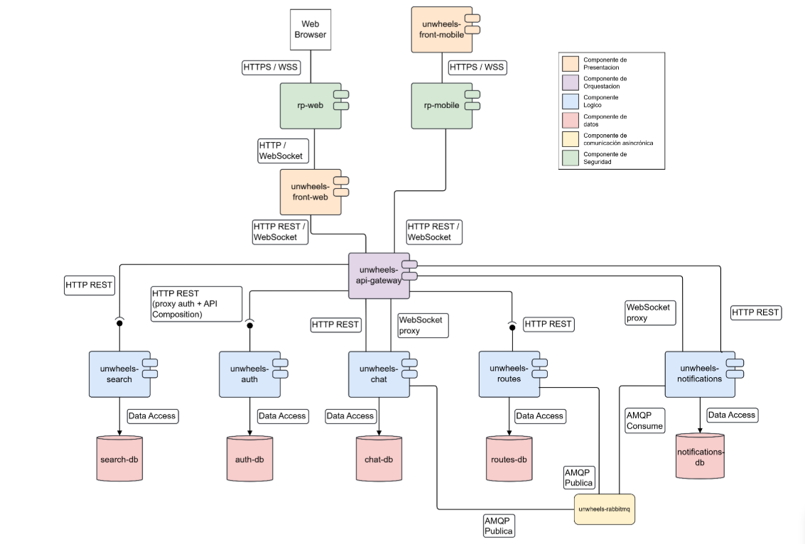
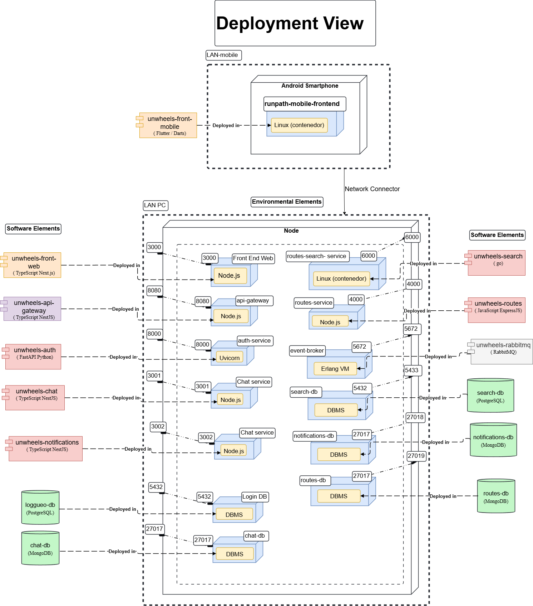
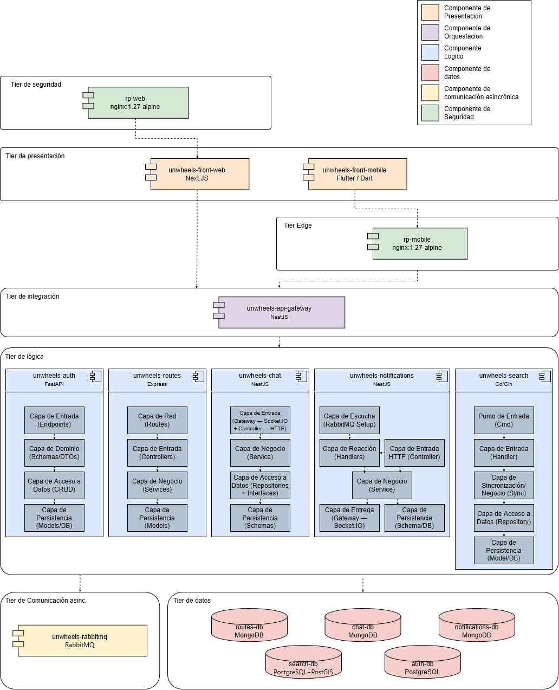
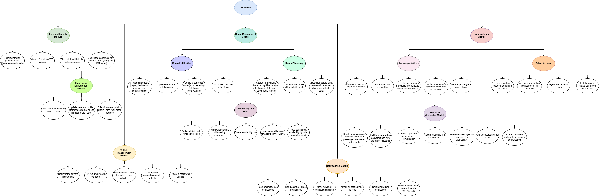
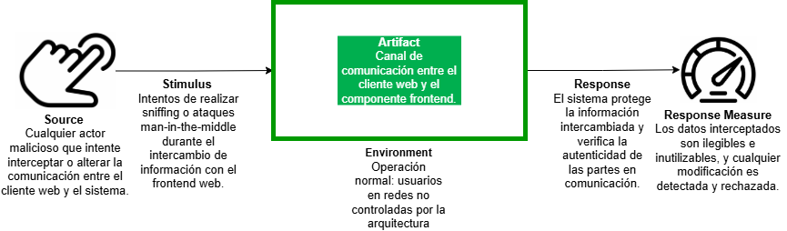
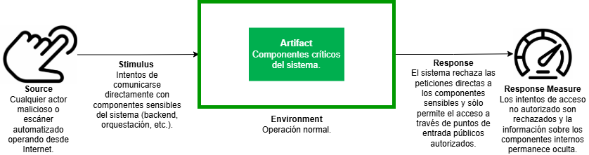
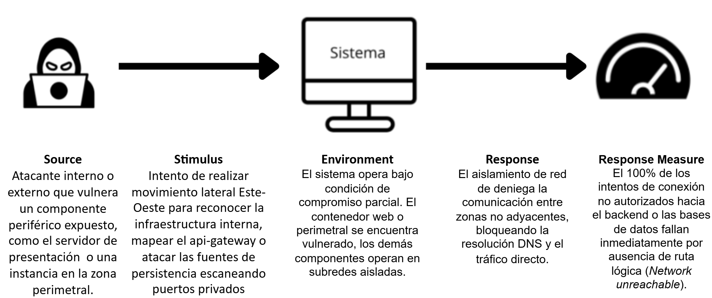
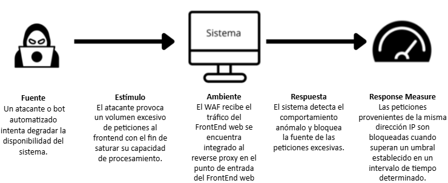
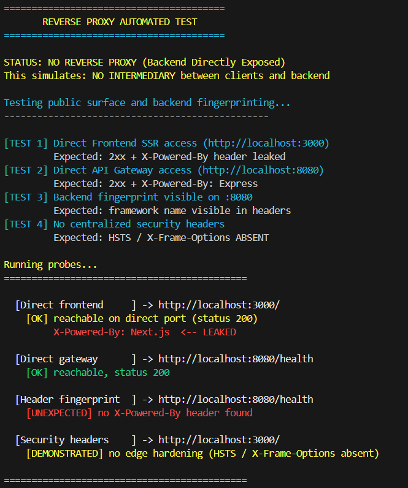
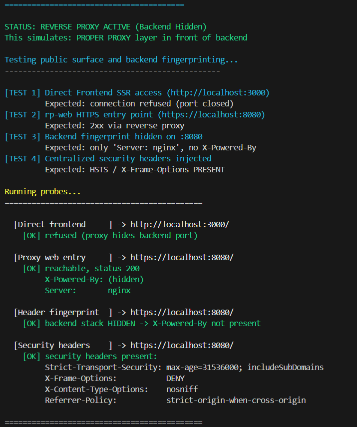

# Prototipo 2 — Estructura Arquitectónica Avanzada

**Arquitectura de Software — 2026-I**
Universidad Nacional de Colombia

---

## 1. Equipo

**Nombre del Equipo:** 2B

| Nombre Completo                |
| ------------------------------ |
| Ana María González Hernández   |
| Iván Daniel Silva Oyola        |
| Daniel Alejandro Ortiz Velosa  |
| Carlos Julián Reyes Piraligua  |
| Sergio Esteban Rendón Umbarila |
| Sergio Alejandro Ruiz Hurtado  |
| Cristian Javier Medina Barrios |
| Camilo Andrés Liévano Rendón   |

---

## 2. Sistema de Software

### Nombre

**UN Wheels**

### Logo

<div align="center">


</div>

### Descripción

UN Wheels es una plataforma de movilidad compartida diseñada para la comunidad universitaria de la Universidad Nacional de Colombia. Conecta estudiantes conductores con estudiantes pasajeros dentro de un ecosistema cerrado y verificado mediante correo institucional (`@unal.edu.co`), centralizando la publicación y gestión de rutas compartidas que hoy ocurren de forma dispersa en plataformas externas como WhatsApp o grupos de Facebook.

El sistema permite a los conductores publicar rutas con horario, paradas, precio por asiento y cupos disponibles, mientras que los pasajeros pueden buscar rutas, reservar cupos y comunicarse directamente con el conductor mediante chat en tiempo real. El modelo se basa en un **usuario único con roles dinámicos**: cualquier estudiante actúa como pasajero por defecto, y al registrar un vehículo adquiere la capacidad de conductor. Las reservas incluyen control de concurrencia para garantizar que no se sobrevendan los cupos.

La arquitectura sigue un patrón de microservicios distribuidos con cinco lenguajes de programación de propósito general distintos (TypeScript, Python, JavaScript, Go, Dart), cinco componentes de tipo lógico, un API Gateway para el tráfico norte-sur, un broker de mensajes (RabbitMQ) para la comunicación este-oeste y la orquestación asíncrona entre servicios, y cinco componentes de tipo datos que incluyen bases de datos relacionales y NoSQL. Todo el sistema se despliega como contenedores Docker orquestados mediante Docker Compose.

---

## 3. Estructuras Arquitectónicas

### 3.1 Estructura de Componentes y Conectores (C&C)

#### Vista C&C

<div align="center">



</div>

El sistema implementa una arquitectura orientada a microservicios, donde cada dominio de negocio está aislado y gestiona su propia persistencia. La comunicación entre estos servicios se rige por un modelo de Mensajería Asíncrona (Event-Driven Architecture) para procesos en segundo plano, y un API Gateway como punto unificado para solicitudes síncronas. El sistema soporta múltiples plataformas cliente (Web Front End y Mobile Device Front End) que consumen este backend compartido.
A nivel de infraestructura y seguridad, el sistema adopta un enfoque de Defensa en Profundidad (Defense in Depth). La arquitectura se basa en una estricta Segmentación de Red dividida en 5 zonas aisladas (compartimentos estancos). Adicionalmente, implementa el patrón de Reverse Proxy con capacidades de Web Application Firewall (WAF) integradas en el mismo componente, operando como una frontera inteligente que inspecciona, filtra y enruta todo el tráfico público antes de que alcance las redes internas.

#### Descripción de Elementos Arquitectónicos y Relaciones

##### Componentes

**Capa Edge**

Es la única zona expuesta al mundo exterior (Internet/Host). Aloja los Reverse Proxies, que fungen simultáneamente como enrutadores y firewalls perimetrales (ModSecurity + OWASP CRS embebido).

| Componente    | Puerto | Descripción                                                                                                                                                                                                                                                                                                                                 |
| ------------- | ------ | ------------------------------------------------------------------------------------------------------------------------------------------------------------------------------------------------------------------------------------------------------------------------------------------------------------------------------------------- |
| **rp-web**    | 8080   | Reverse proxy dedicado al cliente web. Enruta el tráfico de páginas hacia el frontend y las conexiones WebSocket directamente al API Gateway. Posee políticas de seguridad flexibles adaptadas a navegadores (ej. permite cargas de hasta 10 MB y admite contenido multipart/form-data para subida de imágenes) e implementa Rate Limiting. |
| **rp-mobile** | 8081   | Reverse proxy dedicado a la aplicación móvil. Enruta el tráfico exclusivamente hacia el API Gateway. Posee un perfil de seguridad sumamente estricto, diseñado para una API pura (límite de carga de 5 MB y aceptación exclusiva de peticiones en formato JSON).                                                                            |

**Capa Web-Zone**

| Componente            | Tecnología | Lenguaje   | Descripción                                                                                                                                                                                                                       |
| --------------------- | ---------- | ---------- | --------------------------------------------------------------------------------------------------------------------------------------------------------------------------------------------------------------------------------- |
| **unwheels-frontweb** | NextJS     | TypeScript | Aplicación encargada del renderizado del lado del servidor (SSR) y de la interfaz de usuario web. Reside en una red aislada a la que solo el rp-web tiene acceso, impidiendo la comunicación directa desde cualquier otra fuente. |

**Capa Gateway-Zone**

| Componente               | Tecnología | Lenguaje   | Descripción                                                                                                                                                                                                                                                                              |
| ------------------------ | ---------- | ---------- | ---------------------------------------------------------------------------------------------------------------------------------------------------------------------------------------------------------------------------------------------------------------------------------------- |
| **unwheels-api-gateway** | NodeJS     | TypeScript | Orquestador principal de la API. Coordina, enruta y consolida las peticiones recibidas hacia los microservicios correspondientes. Recibe tráfico validado directamente desde rp-mobile, solicitudes internas desde el unwheels-front-web, y conexiones WebSocket enviadas por el rp-web. |

**Capa Services**

| Componente                 | Tecnología                                   | Lenguaje             | Puerto | Descripción                                                                                                                                                                                                                                                                |
| -------------------------- | -------------------------------------------- | -------------------- | ------ | -------------------------------------------------------------------------------------------------------------------------------------------------------------------------------------------------------------------------------------------------------------------------- |
| **unwheels-auth**          | FastAPI + SQLAlchemy + Pydantic v2 + Uvicorn | Python 3.x           | 8000   | Autenticación, registro de usuarios (validando dominio `@unal.edu.co`), emisión y validación de JWT, y gestión de perfiles y vehículos. Es el único servicio que emite tokens JWT.                                                                                         |
| **unwheels-routes**        | Express.js + Mongoose                        | JavaScript (Node.js) | 4000   | Gestión del ciclo de vida completo de rutas y reservas: creación, consulta, control de concurrencia para cupos, y transiciones de estado de reservas (PENDING → CONFIRMED / REJECTED). Publica eventos de dominio en RabbitMQ al completar operaciones de negocio.         |
| **unwheels-chat**          | NestJS + Socket.IO + Mongoose                | TypeScript (Node.js) | 3001   | Mensajería bidireccional en tiempo real entre conductores y pasajeros. Expone un Gateway Socket.IO para mensajería en tiempo real y un Controller HTTP para consultar historial y listar conversaciones. Publica eventos `chat.message` en RabbitMQ.                       |
| **unwheels-notifications** | NestJS + Socket.IO + Mongoose                | TypeScript (Node.js) | 3002   | Consumidor de eventos asíncronos de RabbitMQ. Persiste notificaciones en MongoDB y las entrega en tiempo real vía WebSocket (Socket.IO, namespace `/notifications`). Actúa como puente AMQP↔WebSocket dentro del mismo proceso.                                            |
| **unwheels-search**        | Gin + pgx/v5                                 | Go                   | 6000   | Búsqueda geoespacial de rutas disponibles. Mantiene un índice de lectura optimizada en PostgreSQL+PostGIS, sincronizado periódicamente con unwheels-routes mediante polling HTTP. Expone un único endpoint público que acepta consultas de texto libre y radio geográfico. |

**Componente de Orquestación**

| Componente            | Tecnología                                              | Descripción                                                                                                                                                                                                                                                                            |
| --------------------- | ------------------------------------------------------- | -------------------------------------------------------------------------------------------------------------------------------------------------------------------------------------------------------------------------------------------------------------------------------------- |
| **unwheels-rabbitmq** | RabbitMQ 3.13 (puertos 5672 AMQP / 15672 Management UI) | Broker de mensajes para comunicación asíncrona este-oeste entre microservicios. Utiliza un topic exchange durable (`uniwheels.events`) con routing keys para enrutamiento de eventos. Habilita el patrón Publish-Subscribe con desacoplamiento total entre productores y consumidores. |

**Componentes de Datos**

| Componente           | Tipo                                      | Usado por              | Descripción                                                                                                                                         |
| -------------------- | ----------------------------------------- | ---------------------- | --------------------------------------------------------------------------------------------------------------------------------------------------- |
| **auth-db**          | PostgreSQL 16 (Relacional)                | unwheels-auth          | Almacena usuarios y vehículos con integridad referencial. Transacciones ACID. Accedido mediante SQLAlchemy ORM.                                     |
| **routes-db**        | MongoDB 7 (Documental)                    | unwheels-routes        | Almacena rutas, reservas y reglas de disponibilidad (SPECIFIC_DATES, WEEKLY_RECURRENCE) con esquemas flexibles. Accedido mediante Mongoose.         |
| **chat-db**          | MongoDB 7 (Documental)                    | unwheels-chat          | Almacena conversaciones y mensajes en formato append-only. Accedido mediante Mongoose.                                                              |
| **notifications-db** | MongoDB 7 (Documental)                    | unwheels-notifications | Almacena historial de notificaciones con TTL de 30 días e índice compuesto por destinatario. Accedido mediante Mongoose.                            |
| **search-db**        | PostgreSQL 16 + PostGIS 3.4 (Geoespacial) | unwheels-search        | Proyección de lectura de rutas con columnas GEOGRAPHY para consultas espaciales eficientes (`ST_DWithin`, `ST_Distance`). Accedido mediante pgx/v5. |

##### Conectores (Relaciones)

**Conectores HTTP (Cliente ↔ Gateway ↔ Servicios)**

| Conector                                    | Tipo                    | Protocolo      | Endpoints                                                 | Dirección                                                                                 |
| ------------------------------------------- | ----------------------- | -------------- | --------------------------------------------------------- | ----------------------------------------------------------------------------------------- |
| Cliente Web → Reverse Proxy Web (WAF)       | Llamada a Procedimiento | HTTPS          | `rp-web:8080`                                             | Bidireccional: Cliente (Navegador Web) → rp-web                                           |
| Cliente Mobile → Reverse Proxy Mobile (WAF) | Llamada a Procedimiento | HTTPS          | `rp-mobile:8081`                                          | Bidireccional: Cliente (App Mobile) → rp-mobile                                           |
| Cliente Web → Gateway (WebSocket bypass)    | Evento                  | WSS            | `/api/`                                                   | Bidireccional: Cliente (Navegador Web) → Gateway                                          |
| Reverse Proxy Web → Frontend Web            | Proxy HTTP Interno      | HTTP           | `rp-web`                                                  | Unidireccional: rp-web → Frontend SSR Container                                           |
| Frontend Web → API Gateway                  | Llamada a Procedimiento | HTTP REST      | `/api/`                                                   | Bidireccional: Frontend → Gateway                                                         |
| Reverse Proxy Mobile → API Gateway          | Proxy HTTP Seguro       | HTTP REST      | `rp-mobile`, `/api/`                                      | Bidireccional: rp-mobile → Gateway                                                        |
| REST (Auth)                                 | Llamada a Procedimiento | HTTP/JSON      | `/api/auth/*`                                             | Bidireccional: Cliente → Gateway → unwheels-auth                                          |
| REST (Routes)                               | Llamada a Procedimiento | HTTP/JSON      | `/api/routes/*`, `/api/reservations/*`, `/api/vehicles/*` | Bidireccional: Cliente → Gateway → unwheels-routes                                        |
| REST (Notifications)                        | Llamada a Procedimiento | HTTP/JSON      | `/api/notifications/*`                                    | Bidireccional: Cliente → Gateway → unwheels-notifications                                 |
| REST (Search)                               | Llamada a Procedimiento | HTTP/JSON      | `/api/search/*`                                           | Bidireccional: Cliente → Gateway → unwheels-search                                        |
| REST (Chat HTTP)                            | Llamada a Procedimiento | HTTP/JSON      | `/api/chat/*`                                             | Bidireccional: Cliente → Gateway → unwheels-chat                                          |
| WebSocket/Socket.IO (Chat)                  | Evento                  | WS + Socket.IO | `/api/chat/socket.io`                                     | Bidireccional: Cliente ↔ Gateway (proxy) ↔ unwheels-chat (namespace `/`)                  |
| WebSocket/Socket.IO (Notif.)                | Evento                  | WS + Socket.IO | `/api/notifications/socket.io`                            | Servidor → Cliente: Gateway (proxy) ↔ unwheels-notifications (namespace `/notifications`) |

**Conectores de Message Broker (Servicio ↔ RabbitMQ)**

| Conector                  | Tipo                             | Protocolo  | Routing Keys                                                            | Publicador → Consumidor                                      |
| ------------------------- | -------------------------------- | ---------- | ----------------------------------------------------------------------- | ------------------------------------------------------------ |
| AMQP (Eventos de Reserva) | Unidireccional: Evento (Pub/Sub) | AMQP 0.9.1 | `reservation.requested`, `reservation.accepted`, `reservation.rejected` | unwheels-routes → unwheels-rabbitmq → unwheels-notifications |
| AMQP (Eventos de Ruta)    | Unidireccional: Evento (Pub/Sub) | AMQP 0.9.1 | `route.deleted`                                                         | unwheels-routes → unwheels-rabbitmq → unwheels-notifications |
| AMQP (Eventos de Chat)    | Unidireccional: Evento (Pub/Sub) | AMQP 0.9.1 | `chat.message`                                                          | unwheels-chat → unwheels-rabbitmq → unwheels-notifications   |

**Conectores de Acceso a Datos**

| Conector                         | Tipo                    | Tecnología          | Componentes                                                                     |
| -------------------------------- | ----------------------- | ------------------- | ------------------------------------------------------------------------------- |
| db_connector_relational          | Acceso a Datos          | SQLAlchemy (Python) | unwheels-auth → auth-db                                                         |
| db_connector_documental (routes) | Acceso a Datos          | Mongoose (Node.js)  | unwheels-routes → routes-db                                                     |
| db_connector_documental (chat)   | Acceso a Datos          | Mongoose (Node.js)  | unwheels-chat → chat-db                                                         |
| db_connector_documental (notif.) | Acceso a Datos          | Mongoose (Node.js)  | unwheels-notifications → notifications-db                                       |
| db_connector_geoespacial         | Acceso a Datos          | pgx/v5 (Go)         | unwheels-search → search-db                                                     |
| http_polling (Search Sync)       | Llamada a Procedimiento | HTTP/JSON           | unwheels-search → unwheels-routes (sincronización periódica del índice PostGIS) |

#### Descripción de Estilos y Patrones Arquitectónicos

| Estilo / Patrón                 | Aplicación en UN Wheels                                                                                                                                                                                                                                                                                         |
| ------------------------------- | --------------------------------------------------------------------------------------------------------------------------------------------------------------------------------------------------------------------------------------------------------------------------------------------------------------- |
| **Microservicios**              | Cinco componentes lógicos independientes (auth, routes, chat, notifications, search), cada uno con su propio código fuente, runtime y datastore dedicado. Los servicios son desplegables de forma independiente y usan la tecnología óptima para su dominio.                                                    |
| **API Gateway**                 | NestJS actúa como punto de entrada único para todo el tráfico externo (norte-sur). Enruta peticiones, centraliza la validación JWT, gestiona cookies HttpOnly y realiza proxy transparente de WebSocket. Los clientes no conocen la topología interna.                                                          |
| **Publish-Subscribe**           | RabbitMQ habilita la comunicación asíncrona (tráfico este-oeste) entre microservicios. Los servicios productores publican eventos de dominio en el topic exchange `uniwheels.events`; el consumidor (notifications) se suscribe con bindings comodín. Esto desacopla completamente productores de consumidores. |
| **Bridge AMQP↔WebSocket**       | unwheels-notifications actúa como puente entre dos protocolos: consume eventos AMQP del broker y los entrega en tiempo real vía Socket.IO al cliente. Ambas interfaces conviven en el mismo proceso, reduciendo la latencia a ≈10–15 ms entre cola y navegador.                                                 |
| **Server-Side Rendering (SSR)** | El frontend web usa Next.js 15 para renderizar páginas en el servidor. El middleware SSR valida la cookie HttpOnly antes de renderizar rutas protegidas, sin exponer el JWT al navegador.                                                                                                                       |
| **Database per Service**        | Cada microservicio posee sus propios datos en una base de datos independiente: auth → PostgreSQL, routes / chat / notifications → MongoDB ×3, search → PostgreSQL+PostGIS. No existe compartición directa de bases de datos entre servicios.                                                                    |
| **SOFEA**                       | El backend nunca genera HTML; solo sirve JSON. Esto permite que el frontend web y el frontend móvil evolucionen de forma independiente sobre la misma superficie de API sin duplicar lógica de backend.                                                                                                         |

---

### 3.2 Estructura de Despliegue

#### Vista de Despliegue

<div align="center">



</div>


#### Descripción de Elementos Arquitectónicos y Relaciones

El sistema se despliega en un único nodo Docker Host (LAN PC) ejecutando Docker Engine con Docker Compose para la orquestación de contenedores. La arquitectura introduce una **Edge Zone** con proxies inversos Nginx como capa de entrada diferenciada por canal (web y móvil). El despliegue se organiza en cinco zonas:


#### Zona Móvil (LAN-mobile)

| Elemento de Despliegue | Runtime | Descripción |
|---|---|---|
| unwheels-front-mobile | Flutter / Dart VM sobre Android (Linux) | Aplicación nativa ejecutada en el smartphone del usuario. Se comunica con el backend a través del reverse proxy móvil (`rp-mobile`) por HTTP/REST y WebSocket en el puerto 8081. |


#### Edge Zone (puertos expuestos al host)

| Elemento de Despliegue | Contenedor | Runtime | Puerto | Descripción |
|---|---|---|---|---|
| rp-web | `reverse-proxy-web` | Nginx | 8080 (host) → 8080 (contenedor) | Punto de entrada del tráfico web. Recibe peticiones del navegador y las enruta hacia el frontend web (puerto 3000) o hacia el `api-gateway` (puerto 8080 interno). |
| rp-mobile | `reverse-proxy-mobile` | Nginx | 8081 (host) → 8081 (contenedor) | Punto de entrada exclusivo del tráfico móvil. Recibe peticiones de la app Flutter y las enruta hacia el `api-gateway`. |


#### Web Zone (red interna Docker)

| Elemento de Despliegue | Contenedor | Runtime | Puerto (interno) | Descripción |
|---|---|---|---|---|
| unwheels-front-web | `web-app` | Node.js (Next.js standalone) | 3000 | Servidor Next.js SSR. Accesible desde el exterior únicamente a través de `rp-web`. |


#### Gateway Zone (red interna Docker)

| Elemento de Despliegue | Contenedor | Runtime | Puerto (interno) | Descripción |
|---|---|---|---|---|
| unwheels-api-gateway | `api-gateway` | Node.js (NestJS) | 8080 | Enrutador central de tráfico backend. Valida JWT, enruta peticiones a los microservicios de negocio y gestiona conexiones WebSocket. Solo accesible desde los reverse proxies de la Edge Zone. |

#### Services Zone (red interna Docker)

| Elemento de Despliegue | Contenedor | Runtime | Puerto (interno) |
|---|---|---|---|
| unwheels-auth | `auth-service` | Python 3.x / Uvicorn (FastAPI) | 8000 |
| unwheels-routes | `routes-service` | Node.js (Express) | 4000 |
| unwheels-chat | `chat-service` | Node.js (NestJS) | 3001 |
| unwheels-notifications | `notifications-service` | Node.js (NestJS) | 3002 |
| unwheels-search | `routes-search-service` | Go / Gin (contenedor Linux) | 6000 |

#### Data Zone (red interna Docker)

| Elemento de Despliegue | Contenedor | Runtime | Puerto (interno) |
|---|---|---|---|
| unwheels-rabbitmq | `event-broker` | RabbitMQ 3.13 (Erlang VM) | 5672 (AMQP) |
| loggueo-db | `login-db` | PostgreSQL 16 | 5432 |
| search-db | `search-db` | PostgreSQL 16 + PostGIS | 5432 |
| chat-db | `chat-db` | MongoDB 7 | 27017 |
| notifications-db | `notifications-db` | MongoDB 7 | 27017 |
| routes-db | `routes-db` | MongoDB 7 | 27017 |


#### Relaciones de Despliegue

- El tráfico web ingresa por `rp-web` (puerto 8080 del host), que lo enruta hacia `web-app` (puerto 3000) o hacia `api-gateway` (puerto 8080 interno) según la ruta.
- El tráfico móvil ingresa exclusivamente por `rp-mobile` (puerto 8081 del host), que lo enruta hacia `api-gateway`.
- El `api-gateway` no está expuesto directamente al host; solo es alcanzable desde los contenedores de la Edge Zone.
- Todos los contenedores de las zonas internas (Web, Gateway, Services y Data) se comunican a través de la red bridge Docker mediante DNS interno basado en nombres de contenedor.
- El `api-gateway` depende de que `auth-service`, `chat-service`, `routes-service` y `notifications-service` estén saludables antes de iniciar (`depends_on: condition: service_healthy`).
- Los proxies inversos (`rp-web`, `rp-mobile`) dependen de que `api-gateway` esté saludable.
- Los microservicios de negocio dependen de sus respectivos datastores y, cuando aplica, de `event-broker`.
- Los datos persistentes se almacenan en volúmenes Docker: `mongodb_data`, `rabbitmq_data` y `postgres_data`.


#### Descripción de Patrones Arquitectónicos

| Patrón | Aplicación |
|---|---|
| **Containerización** | Cada componente se empaqueta como una imagen Docker con su propio Dockerfile. Garantiza despliegues reproducibles, aislados y portables entre entornos. |
| **Dual Reverse Proxy (Edge Zone)** | Dos instancias Nginx separan el canal web (puerto 8080) del canal móvil (puerto 8081) como únicos puntos de entrada al sistema. Esto permite políticas de enrutamiento, TLS y rate-limiting diferenciadas por tipo de cliente sin exponer directamente ningún servicio de negocio. |
| **Aislamiento de Red Interna** | La red bridge Docker `unwheels_default` aísla los servicios internos. Los proxies de la Edge Zone son los únicos contenedores con puertos publicados al host; el resto solo hace `expose`. |
| **Database per Service** | Cada microservicio tiene su propia instancia de base de datos en un contenedor independiente con su propio volumen Docker. Ningún par de servicios comparte base de datos, garantizando acoplamiento débil en la capa de datos. |
| **Health Check + Dependency Order** | Todos los contenedores definen healthchecks en `docker-compose.yml`. Docker Compose los usa para garantizar el orden de arranque, evitando condiciones de carrera donde un servicio intenta conectarse a un recurso aún no disponible. |
| **Despliegue en Nodo Único** | Para este prototipo, todos los contenedores se ejecutan en un único Docker Host mediante Docker Compose. La zonificación de la arquitectura (Edge / Web / Gateway / Services / Data) está diseñada para migrar a orquestadores como Kubernetes con mínimo refactoring. |

---

### 3.3 Estructura en Capas

#### Vista en Capas

<div align="center">



</div>

#### Descripción de Elementos Arquitectónicos y Relaciones

El sistema está organizado en cinco niveles (tiers). La relación entre niveles es de tipo **"allowed to use"**: un nivel superior tiene permitido usar los servicios del nivel inmediatamente inferior, pero nunca al revés. Esta restricción impone la dirección de dependencia y garantiza la separación de responsabilidades característica de la arquitectura en capas.

**Nivel 1 — Presentación**

| Elemento              | Tecnología                        | Lenguaje   | Capas Internas                                                                                                                                                                                                   |
| --------------------- | --------------------------------- | ---------- | ---------------------------------------------------------------------------------------------------------------------------------------------------------------------------------------------------------------- |
| **1.1 Cliente Web**   | Next.js 15 + React + Tailwind CSS | TypeScript | L1: Pages / Middleware SSR (rutas protegidas), L2: Componentes React (UI reactiva), L3: Lógica de Negocio Cliente (React Query, contextos globales), L4: Acceso a Datos (HTTP/REST + Socket.IO Client → Gateway) |
| **1.2 Cliente Móvil** | Flutter 3.x                       | Dart       | L1: Screens / UI (widgets Flutter), L2: Lógica de Presentación (Provider/Bloc, gestión de estado), L3: Dominio (casos de uso, modelos independientes de UI), L4: Acceso a Datos (repositorios → Gateway)         |

_Relación con Nivel 2:_ Nivel 1 **allowed to use** Nivel 2. Los clientes únicamente pueden invocar servicios expuestos por el API Gateway; no tienen visibilidad directa sobre los microservicios del Nivel 3 ni sobre capas inferiores.

**Nivel 2 — Gateway**

| Elemento        | Tecnología          | Capas Internas                                                                                                                                                                                                                                                                         |
| --------------- | ------------------- | -------------------------------------------------------------------------------------------------------------------------------------------------------------------------------------------------------------------------------------------------------------------------------------- |
| **API Gateway** | NestJS / TypeScript | L1: Entrada pública (endpoints externos, CORS, cookies HttpOnly), L2: Proxy y enrutamiento (pathRewrite, proxy WebSocket transparente), L3: Middleware (validación JWT, Helmet, gestión de sesiones), L4: Integración (enriquecimiento de respuestas, comunicación con microservicios) |

_Relación con Nivel 3:_ Nivel 2 **allowed to use** Nivel 3. El Gateway puede enrutar peticiones hacia los microservicios lógicos; los microservicios no conocen ni dependen del Gateway.

**Nivel 3 — Lógica**

Cada servicio lógico sigue una arquitectura interna en capas:

| Elemento                       | Tecnología | Lenguaje   | L1 (API)                                     | L2 (Aplicación)                                    | L3 (Dominio)                         | L4 (Infraestructura)          |
| ------------------------------ | ---------- | ---------- | -------------------------------------------- | -------------------------------------------------- | ------------------------------------ | ----------------------------- |
| **3.1 unwheels-auth**          | FastAPI    | Python     | REST API (routers FastAPI)                   | Application (lógica de auth, JWT)                  | User, Vehicle (schemas Pydantic)     | PostgreSQL (SQLAlchemy)       |
| **3.2 unwheels-routes**        | Express.js | JavaScript | REST API (routes Express)                    | Application (control de cupos, estados de reserva) | Route, Reservation, AvailabilityRule | MongoDB (Mongoose) + AMQP     |
| **3.3 unwheels-chat**          | NestJS     | TypeScript | Socket.IO Gateway + REST Controller          | Application (permisos, historial)                  | Conversation, Message                | MongoDB (Mongoose) + AMQP     |
| **3.4 unwheels-notifications** | NestJS     | TypeScript | AMQP Consumer + REST Controller + WS Gateway | Application (persistencia y entrega)               | Notification                         | MongoDB (Mongoose)            |
| **3.5 unwheels-search**        | Gin        | Go         | REST Handler (Gin)                           | Application (sincronización y búsqueda)            | Route (proyección de lectura)        | PostgreSQL + PostGIS (pgx/v5) |

**Flujo de eventos (Publica / Suscribe):**

- unwheels-routes publica: `reservation.requested`, `reservation.accepted`, `reservation.rejected`, `route.deleted`
- unwheels-chat publica: `chat.message`
- unwheels-notifications consume (bindings): `reservation.#`, `route.#`, `chat.#`

_Relación con Nivel 4:_ Nivel 3 **allowed to use** Nivel 4. Los servicios lógicos pueden publicar y consumir mensajes del broker asíncrono; el broker no tiene conocimiento de la lógica de negocio de los servicios.

**Nivel 4 — Comunicación Asíncrona**

| Elemento                              | Tecnología                     | Descripción                                                                                                                                                                 |
| ------------------------------------- | ------------------------------ | --------------------------------------------------------------------------------------------------------------------------------------------------------------------------- |
| **RabbitMQ 3.13** (unwheels-rabbitmq) | AMQP 0.9.1 + Management Plugin | Topic exchange `uniwheels.events` (durable). Cola: `notifications_queue` (durable, bindings: `reservation.#`, `route.#`, `chat.#`). Dead Letter Queue: `notifications.dlq`. |

_Relación con Nivel 5:_ Nivel 3 **allowed to use** Nivel 5 (acceso directo desde los servicios lógicos a sus datastores). El Nivel 4 (broker) no accede directamente a los datos; actúa únicamente como intermediario de mensajería.

**Nivel 5 — Datos**

| Elemento                 | Tecnología                  | Tipo               | Descripción                                                                                                                         |
| ------------------------ | --------------------------- | ------------------ | ----------------------------------------------------------------------------------------------------------------------------------- |
| **5.1 auth-db**          | PostgreSQL 16               | Relacional (SQL)   | Tablas: users, vehicles. Integridad referencial, transacciones ACID. Accedido mediante SQLAlchemy ORM.                              |
| **5.2 routes-db**        | MongoDB 7                   | Documental (NoSQL) | Colecciones: routes, reservations, availability_rules. Esquemas flexibles con reglas de disponibilidad. Accedido mediante Mongoose. |
| **5.3 chat-db**          | MongoDB 7                   | Documental (NoSQL) | Colecciones: conversations, messages. Patrón append-only, alta tasa de escritura. Accedido mediante Mongoose.                       |
| **5.4 notifications-db** | MongoDB 7                   | Documental (NoSQL) | Colección: notifications. TTL de 30 días, índice compuesto `{recipientEmail, read, createdAt}`. Accedido mediante Mongoose.         |
| **5.5 search-db**        | PostgreSQL 16 + PostGIS 3.4 | Geoespacial (SQL)  | Proyección de lectura de rutas. Columnas GEOGRAPHY, índice GiST para `ST_DWithin`, `ST_Distance`. Accedido mediante pgx/v5.         |

#### Descripción de Patrones Arquitectónicos

| Patrón                                       | Aplicación                                                                                                                                                                                                                                                                                                                                                                 |
| -------------------------------------------- | -------------------------------------------------------------------------------------------------------------------------------------------------------------------------------------------------------------------------------------------------------------------------------------------------------------------------------------------------------------------------- |
| **Arquitectura en Capas (N-Tier)**           | El sistema impone una separación estricta en cinco niveles: Presentación → Gateway → Lógica → Comunicación Asíncrona → Datos. Cada nivel depende únicamente del nivel directamente inferior, garantizando separación de responsabilidades.                                                                                                                                 |
| **Clean Architecture / Hexagonal (parcial)** | Cada microservicio (Nivel 3) sigue internamente una arquitectura de cuatro capas: API (adaptadores de entrada) → Aplicación (lógica de negocio) → Dominio (entidades) → Infraestructura (adaptadores de salida). La lógica de dominio no tiene dependencias de frameworks. Aplicado especialmente en unwheels-chat y unwheels-notifications mediante el patrón Repository. |
| **CQRS-Adjacent (Read Model Segregation)**   | unwheels-search mantiene una proyección de lectura optimizada en PostGIS, sincronizada periódicamente con routes-db. Las escrituras van a unwheels-routes y las consultas geoespaciales a unwheels-search, separando patrones de acceso incompatibles.                                                                                                                     |
| **Asynchronous Messaging Pattern**           | RabbitMQ (Nivel 4) desacopla los servicios productores del consumidor. Los servicios de Nivel 3 publican eventos de dominio sin conocer a los consumidores; los mensajes son durables, garantizando entrega incluso si el consumidor está temporalmente caído.                                                                                                             |

---

### 3.4 Estructura de Descomposición

#### Vista de Descomposición

<div align="center">



</div>

#### Descripción de Elementos Arquitectónicos y Relaciones

El sistema se descompone en siete módulos funcionales, cada uno responsable de un conjunto cohesivo de funcionalidades:

| Módulo                        | Submódulos                                    | Funcionalidades Hoja                                                                                                                                                                                                                                                                          |
| ----------------------------- | --------------------------------------------- | --------------------------------------------------------------------------------------------------------------------------------------------------------------------------------------------------------------------------------------------------------------------------------------------- |
| **Autenticación e Identidad** | Cuentas, Sesión                               | Registrar usuario (validando `@unal.edu.co`); Iniciar sesión (emitir JWT); Cerrar sesión; Validar token JWT en cada solicitud.                                                                                                                                                                |
| **Gestión de Perfil**         | Perfil propio, Perfil público                 | Leer y actualizar datos personales (nombre, teléfono, carrera, edad); Leer perfil público de otro usuario.                                                                                                                                                                                    |
| **Gestión de Vehículos**      | CRUD de vehículos                             | Registrar nuevo vehículo; Listar vehículos propios; Consultar detalle; Eliminar vehículo registrado.                                                                                                                                                                                          |
| **Gestión de Rutas**          | Publicación, Disponibilidad, Descubrimiento   | Crear/actualizar/eliminar rutas propias; Agregar/eliminar reglas de disponibilidad (fechas específicas o recurrencia semanal); Vista de calendario de cupos; Buscar rutas por filtros (origen, destino, fecha, radio geográfico); Ver detalle enriquecido con datos del conductor y vehículo. |
| **Reservaciones**             | Acciones del Pasajero, Acciones del Conductor | Solicitar asiento; Cancelar reserva propia; Ver historial de viajes; Listar solicitudes pendientes del conductor; Aceptar/rechazar solicitudes de reserva.                                                                                                                                    |
| **Mensajería en Tiempo Real** | Conversaciones, Mensajes                      | Crear conversación conductor↔pasajero vinculada a una ruta; Listar conversaciones con último mensaje; Enviar y recibir mensajes en tiempo real (WebSocket); Consultar historial paginado.                                                                                                     |
| **Notificaciones**            | Alertas, Historial                            | Recibir notificaciones en tiempo real (WebSocket); Consultar historial paginado; Ver contador de no leídas; Marcar como leídas (individual o todas).                                                                                                                                          |

**Relaciones entre módulos:**

- **Autenticación e Identidad** es un módulo transversal: todos los demás módulos dependen de él para identificar y autorizar al usuario en cada operación.
- **Gestión de Rutas → Reservaciones:** La creación de una reserva requiere que exista una ruta con cupos disponibles; la eliminación de una ruta cancela en cascada las reservas asociadas.
- **Reservaciones → Notificaciones:** Los cambios de estado de una reserva (aceptada, rechazada) desencadenan notificaciones automáticas al pasajero vía RabbitMQ.
- **Mensajería en Tiempo Real → Notificaciones:** Cuando se envía un mensaje a un usuario desconectado, se genera una notificación persistente vía RabbitMQ.
- **Gestión de Rutas → Búsqueda (Descubrimiento):** El servicio de búsqueda sincroniza periódicamente su índice PostGIS con los datos de rutas activas del módulo de Gestión de Rutas.

---

## 4. Atributos de Calidad — Seguridad

### 4.1 Escenarios de Seguridad

#### Escenario 1 – Interceptación No Autorizada y Compromiso del Enlace de Red

- **Source:** Atacante pasivo o activo con acceso a la red por la cual viajan las peticiones del usuario, red Wi-Fi universitaria compartida, red del ISP o nodo intermedio comprometido, capaz de ejecutar ataques MITM o de capturar tráfico.
- **Stimulus:** Intentos de realizar _sniffing_ o ataques _man-in-the-middle_ durante el intercambio de información con el frontend web. El atacante intercepta el tráfico entre un cliente (frontend web o aplicación móvil) con el objetivo de: (a) capturar la cookie access_token HttpOnly que autentica la sesión, (b) leer datos de ubicación geográfica (latitud/longitud) transmitidos al buscar o publicar rutas, o (c) inyectar respuestas falsificadas que alteren la disponibilidad de cupos o el estado de una reserva.
- **Artifact:** Canal de comunicación entre el cliente web y el componente frontend.
- **Environment:** Operación normal del sistema en producción. Los usuarios acceden a la plataforma desde redes no controladas por la arquitectura, redes Wi-Fi universitarias, redes móviles o redes domésticas, con el sistema procesando autenticaciones, búsquedas de rutas con coordenadas GPS y mensajes de chat en tiempo real.
- **Response:** El sistema protege la información intercambiada y verifica la autenticidad de las partes en comunicación. Todo el tráfico HTTP se sirve sobre HTTPS y todo el tráfico WebSocket sobre WSS. Las conexiones que intenten utilizar TLS 1.0, TLS 1.1, HTTP plano o WS plano son rechazadas con código 426 Upgrade Required o cierre inmediato de conexión. La cookie access_token se emite con los atributos HttpOnly, Secure y SameSite=Lax, lo que impide su lectura desde JavaScript y restringe su transmisión a conexiones cifradas. Las coordenadas geográficas y los datos de reserva viajan únicamente dentro del payload cifrado, sin exposición en parámetros de URL.
- **Response measure:** Los datos interceptados son ilegibles e inutilizables, y cualquier modificación es detectada y rechazada. El 100% del tráfico entre los clientes y los componentes de presentación viaja cifrado; cero sesiones HTTP o WS planas son aceptadas. La cookie access_token no es recuperable mediante captura de tráfico con herramientas como Wireshark en ninguna sesión activa. Cero tokens de sesión o coordenadas de usuario son legibles en texto claro en capturas de red de integración.

- **Debilidad:** Los enlaces de red entre cliente y sistema pueden ser observados o manipulados en redes compartidas o no confiables.
- **Vulnerabilidad:** Si el canal permitiera HTTP/WS plano o TLS débil (o existiera _downgrade_), un atacante podría leer o alterar contenido en tránsito.
- **Riesgo (Confidencialidad/Integridad):** Exposición de tokens de sesión y datos sensibles (ubicación, reservas) o inyección de respuestas falsas que afecten el estado del sistema.
- **Amenaza:** Actor con capacidad de interceptación (MITM) en Wi-Fi pública/ISP/nodo intermedio.
- **Ataque:** _Sniffing_, _SSL stripping_ y manipulación de mensajes durante el intercambio cliente↔frontend.
- **Contramedida:** Secure Channel (HTTPS/WSS + TLS fuerte) con rechazo de tráfico plano, HSTS y políticas de cookies (HttpOnly/Secure/SameSite) para reducir robo de sesión.



---

#### Escenario 2 – Acceso No Autorizado a Componentes Privados

- **Source:** Cualquier actor malicioso o escáner automatizado operando desde Internet. Incluye bots de enumeración de puertos, _crawlers_ y herramientas de reconocimiento.
- **Stimulus:** Intentos de comunicarse directamente con componentes sensibles del sistema (backend, orquestación, etc.). El atacante busca saltarse los puntos de entrada autorizados y alcanzar rutas internas o puertos no destinados a exposición pública.
- **Artifact:** Componentes críticos del sistema. Por ejemplo: API Gateway, microservicios, broker de eventos y bases de datos.
- **Environment:** Operación normal. El sistema está desplegado en contenedores con redes privadas y un borde expuesto controlado por reverse proxy.
- **Response:** El sistema rechaza las peticiones directas a los componentes sensibles y sólo permite el acceso a través de puntos de entrada públicos autorizados. Esto reduce la superficie pública y centraliza la validación y el enrutamiento en el borde.
- **Response measure:** Los intentos de acceso no autorizado son rechazados y la información sobre los componentes internos permanece oculta. Desde el host, únicamente los puntos de entrada del reverse proxy son accesibles; los servicios internos no exponen puertos públicos.

- **Debilidad:** Exponer múltiples endpoints/puertos directamente al host incrementa la superficie de ataque y facilita el reconocimiento.
- **Vulnerabilidad:** Publicación accidental de puertos de servicios internos (o rutas internas accesibles) permite acceso directo y _fingerprinting_ del stack.
- **Riesgo (Confidencialidad/Integridad):** Un atacante puede descubrir la topología y atacar servicios sin pasar por controles centralizados, comprometiendo datos o ejecución de operaciones no autorizadas.
- **Amenaza:** Escáneres automatizados y actores maliciosos que enumeran puertos y endpoints públicos.
- **Ataque:** _Port scanning_ + invocación directa a `:3000/:8080` u otros puertos publicados; enumeración de rutas y cabeceras.
- **Contramedida:** Reverse Proxy + ocultamiento de cabeceras y exposición mínima (solo proxies al host), con políticas de enrutamiento/allow-list y hardening centralizado.



---

#### Escenario 3 – Exposición Pública de Componentes Críticos

- **Source:** Atacante interno o externo que ha obtenido acceso inicial a una parte pública de bajo valor del sistema. Puede tratarse de un compromiso del frontend, de una cuenta con privilegios mínimos o de un contenedor expuesto.
- **Stimulus:** El atacante intenta movimiento lateral para acceder a otros componentes sensibles (bases de datos, servicios, etc.). Esto incluye probar conectividad a puertos internos y buscar rutas de red hacia la capa de datos.
- **Artifact:** Componentes críticos del sistema. En particular, servicios y almacenes de datos ubicados en redes privadas internas.
- **Environment:** Tras el compromiso de una parte pública de bajo valor del sistema. El resto de componentes opera en zonas aisladas con reglas de comunicación explícitas.
- **Response:** El sistema mantiene la separación de acceso entre componentes, evitando el acceso no autorizado a los recursos internos. La segmentación restringe explícitamente qué redes privadas pueden comunicarse entre sí, limitando el movimiento lateral hacia servicios y bases de datos.
- **Response measure:** Los intentos de enviar peticiones de red a otros componentes son bloqueados, y los recursos objetivo permanecen inaccesibles y protegidos. Incluso con un compromiso inicial, los intentos de alcanzar recursos fuera de su zona fallan por ausencia de ruta o por reglas de aislamiento entre redes.

- **Debilidad:** Una red plana o con reglas permisivas permite movimiento lateral desde un componente comprometido hacia servicios y datos internos.
- **Vulnerabilidad:** Conectividad este-oeste excesiva entre contenedores (misma red para todo o ACLs laxas) habilita accesos no previstos a bases de datos y backends.
- **Riesgo (Confidencialidad/Integridad/Disponibilidad):** Exfiltración o manipulación de datos internos y afectación de continuidad del servicio mediante escalamiento lateral.
- **Amenaza:** Atacante que obtiene un punto de apoyo inicial en un componente expuesto o de menor criticidad.
- **Ataque:** Movimiento lateral: exploración de red interna, conexión a puertos de servicios/DB y abuso de credenciales/variables expuestas.
- **Contramedida:** Network Segmentation (zonas aisladas por red) con comunicación explícita solo entre componentes autorizados, limitando rutas y accesos internos.



---

#### Escenario 4 – Degradación o Negación del Servicio por Tráfico Excesivo

- **Source:** Atacante o bot automatizado que intenta degradar la disponibilidad del sistema. Puede provenir de una sola IP o de múltiples orígenes coordinados.
- **Stimulus:** Envío de un volumen excesivo de peticiones al frontend con el fin de saturar su capacidad de procesamiento. Se manifiesta como ráfagas de solicitudes, conexiones concurrentes y repetición de rutas costosas.
- **Artifact:** El componente unwheels-web-frontend y su punto de entrada público. En la práctica, el tráfico entra por el reverse proxy que protege este endpoint.
- **Environment:** Operación normal bajo alto tráfico de peticiones. El sistema debe distinguir entre picos legítimos y patrones anómalos sin degradar la experiencia de usuarios válidos.
- **Response:** El sistema detecta el comportamiento anómalo y bloquea la fuente de las peticiones excesivas. La mitigación ocurre en el WAF del reverse proxy antes de que el tráfico llegue al frontend.
- **Response measure:** Las peticiones provenientes de la misma dirección IP son bloqueadas cuando superan un umbral establecido en un intervalo de tiempo determinado. El bloqueo temporal y la denegación de solicitudes preservan la disponibilidad para usuarios legítimos bajo carga anómala.

- **Debilidad:** Un endpoint público sin control de tasa es susceptible a saturación por volumen de solicitudes.
- **Vulnerabilidad:** Ausencia de rate limiting, límites de conexión o filtros de WAF permite que tráfico automatizado consuma recursos del frontend.
- **Riesgo (Disponibilidad):** Degradación del rendimiento o caída del servicio para usuarios legítimos por agotamiento de CPU/memoria/conexiones.
- **Amenaza:** Bots o atacantes que generan tráfico masivo (HTTP flood) dirigido a los puntos de entrada.
- **Ataque:** Envío de ráfagas concurrentes y repetidas a rutas del frontend para elevar latencia y agotar recursos.
- **Contramedida:** WAF con rate limiting, _throttling_ y bloqueo temporal (y/o _challenge-response_) aplicado en el reverse proxy antes de llegar al frontend.



---

### 4.2 Tácticas Arquitectónicas Aplicadas

#### 1. Encrypt Data

**Descripción:** Esta táctica busca proteger la confidencialidad e integridad de los datos en tránsito mediante cifrado extremo a extremo, autenticación de entidades y verificación de la integridad de los mensajes (por ejemplo, TLS con certificados y mecanismos MAC).

**Aplicación:** Se aplica sobre el canal público entre el navegador web y el componente unwheels-web-frontend, garantizando que todas las peticiones HTTP se negocien como HTTPS (TLS). La evidencia operativa incluye certificados digitales válidos en el frontend y la negociación TLS en los puertos públicos.

**Patrón asociado:** Secure Channel Pattern.

#### 2. Limit Access

**Descripción:** Esta táctica se centra en minimizar la superficie de ataque y controlar el acceso a los recursos internos mediante intermediarios y políticas de filtrado: reducir la exposición de endpoints, imponer reglas estrictas de enrutamiento, ocultar metadatos y bloquear tráfico no autorizado antes de que alcance los servicios internos.

**Aplicación:** Se implementa en los puntos de entrada públicos (los reverse proxies que sirven a los frontends web y móvil). Estos proxies aplican reglas de enrutamiento, listas de control de acceso y filtros que sólo permiten tráfico explícitamente autorizado hacia los servicios mapeados, ocultando las direcciones internas y las cabeceras. También se evidencia en las reglas de acceso entre subredes, que restringen qué entidades pueden invocar a los servicios alojados en las redes privadas internas.

**Patrón asociado:** Reverse Proxy Pattern.

#### 3. Detect Service Denial

**Descripción:** Esta táctica busca detectar y mitigar los intentos de degradación del servicio mediante análisis de tráfico en tiempo real (detección de ráfagas, IPs sospechosas y patrones de petición anómalos) y aplicar contramedidas automáticas como rate limiting, _throttling_ de conexiones, bloqueo temporal y mecanismos _challenge-response_. El objetivo es preservar la disponibilidad para los usuarios legítimos mientras se filtra la carga maliciosa.

**Aplicación:** Se implementa en la capa WAF integrada en el proxy de entrada del frontend web, donde se monitorean continuamente las métricas de tasa de petición y las firmas de ataque. Las políticas de mitigación se ejecutan en esta capa antes de que el tráfico alcance al componente unwheels-web-frontend.

**Patrón asociado:** Web Application Firewall (WAF) Pattern.

---

### 4.3 Patrones Arquitectónicos Aplicados

#### 1. Secure Channel Pattern

El sistema UN Wheels aplica el **Secure Channel Pattern**. Esto se evidencia en el conector dispuesto para el frontend web, garantizando que todos los mensajes se intercambien mediante el protocolo HTTPS, el cual cifra y valida todas las peticiones y respuestas. El patrón protege las credenciales del usuario y la información sensible frente a posibles atacantes que estén espiando el canal de comunicación.

#### 2. Reverse Proxy Pattern

El sistema UN Wheels aplica el **Reverse Proxy Pattern**. En el sistema se implementan dos reverse proxies para los endpoints públicos (uno para el cliente web y otro para el cliente móvil). Estos proxies median la comunicación entre los clientes y el sistema de forma segura, redirigiendo las peticiones a sus componentes correspondientes y enmascarando toda la infraestructura interna, incluyendo el API Gateway. El patrón protege al sistema frente a intentos de escaneo o ataque contra los servicios internos.

#### 3. Network Segmentation Pattern

El sistema UN Wheels aplica el **Network Segmentation Pattern**. Cada nivel del sistema se encuentra aislado dentro de una red privada, permitiendo la comunicación únicamente entre componentes de capas de red adyacentes. Esto impide el acceso a componentes privados aunque un atacante obtenga información sobre su ubicación. El patrón previene que entidades no autorizadas envíen peticiones directas a los componentes del backend, protegiéndolos frente a ataques directos.

#### 4. Web Application Firewall (WAF) Pattern

El sistema UN Wheels aplica el **Web Application Firewall (WAF) Pattern**. El sistema integra un WAF dentro del reverse proxy en el punto de entrada del cliente web, estableciendo un umbral sobre las peticiones entrantes desde una misma dirección IP en un intervalo de tiempo determinado, y mostrando una ventana de bloqueo con un mensaje de advertencia cuando se activa la regla. El patrón protege al componente del frontend web frente a posibles ataques de Denegación de Servicio (DoS).

---

### 4.4 Relación entre Patrones Aplicados y Escenarios

| **Escenario**                                                             | **Patrón**                             | **Explicación**                                                                                                                                                      |
| ------------------------------------------------------------------------- | -------------------------------------- | -------------------------------------------------------------------------------------------------------------------------------------------------------------------- |
| Escenario 1 – Interceptación No Autorizada y Compromiso del Enlace de Red | Secure Channel Pattern                 | Garantiza que todas las comunicaciones entre el cliente y el frontend estén cifradas y autenticadas, preservando la confidencialidad e integridad de los datos.      |
| Escenario 2 – Acceso No Autorizado a Componentes Privados                 | Reverse Proxy Pattern                  | Filtra y controla todo el tráfico entrante, exponiendo únicamente los endpoints públicos autorizados y enmascarando los componentes internos y la estructura de red. |
| Escenario 3 – Exposición Pública de Componentes Críticos                  | Network Segmentation Pattern           | Separa al sistema en zonas de red aisladas, evitando el movimiento lateral y el acceso no autorizado a los servicios sensibles del backend.                          |
| Escenario 4 – Degradación o Negación del Servicio por Tráfico Excesivo    | Web Application Firewall (WAF) Pattern | Monitorea y limita las tasas de petición, bloqueando el tráfico sospechoso o excesivo para mantener la disponibilidad del sistema frente a ataques DoS.              |

---

### 4.5 Pruebas de Verificación


#### 1. Reverse Proxy (Superficie Pública y Hardening Centralizado)

Se ejecutó una verificación automatizada comparando dos escenarios: **(1) sin reverse proxy** y **(2) con reverse proxy activo**. En el escenario *before*, se expusieron directamente al host el Frontend SSR (`:3000`) y el API Gateway (`:8080`), aumentando la superficie pública y permitiendo inferir la tecnología del backend desde cabeceras como `X-Powered-By`.

En el escenario *after*, el acceso directo al puerto del frontend queda bloqueado y la entrada pública se concentra en el proxy (ej. `https://localhost:8080`), ocultando el *fingerprint* del backend y aplicando *hardening* centralizado mediante cabeceras de seguridad (HSTS, `X-Frame-Options`, `X-Content-Type-Options`, etc.).





---

### 4.6 Evidencia de Despliegue

Al ejecutar `docker compose ps` sobre el stack final se observa que **únicamente los reverse proxies tienen puertos publicados al host**, materializando conjuntamente los cuatro patrones aplicados:

```
NAME                    PORTS
rp-web                  0.0.0.0:8080->443/tcp
rp-mobile               0.0.0.0:8081->443/tcp
api-gateway             (sin puertos)
web-app                 (sin puertos)
auth-service            (sin puertos)
chat-service            (sin puertos)
notifications-service   (sin puertos)
routes-service          (sin puertos)
route-search-service    (sin puertos)
auth-db                 (sin puertos)
chat-db                 (sin puertos)
notifications-db        (sin puertos)
routes-db               (sin puertos)
route-search-postgres   (sin puertos)
event-broker            (sin puertos)
```

Esta tabla resume la materialización conjunta de los cuatro patrones: **Secure Channel** (TLS terminado dentro de los contenedores `rp-web` y `rp-mobile` en el puerto 443), **Reverse Proxy** (sólo dichos contenedores exponen puertos al host), **Network Segmentation** (todos los demás componentes están aislados en redes privadas internas) y **WAF** (incorporado en la imagen base de ambos reverse proxies).

---

## 5. Prototipo

### Instrucciones de Descarga y Ejecución

**Prerrequisitos:**

- Docker Desktop ≥ 24.x (incluye Docker Compose v2)
- Git
- Puertos disponibles: 3000 (Frontend Web), 8080 (API Gateway), 5672/15672 (RabbitMQ)

**Paso 1 — Clonar los repositorios:**

```bash
mkdir un-wheels && cd un-wheels

git clone https://github.com/UN-Wheels/FrontEnd.git
git clone https://github.com/UN-Wheels/api-gateway.git
git clone https://github.com/UN-Wheels/loggueo_service.git
git clone https://github.com/UN-Wheels/chat-service.git
git clone https://github.com/UN-Wheels/routes-reservations-service.git
git clone https://github.com/UN-Wheels/notifications-service.git
git clone https://github.com/UN-Wheels/search-service.git
git clone https://github.com/UN-Wheels/mobile.git
git clone https://github.com/UN-Wheels/security.git
```

La estructura debe quedar así:

```
un-wheels/
├── api-gateway/
├── chat-service/
├── FrontEnd/                  ← contiene docker-compose.yml
├── loggueo_service/
├── mobile/
├── notifications-service/
├── routes-reservations-service/
└── search-service/
```

**Paso 2 — Configurar variables de entorno:**

| Servicio              | Archivo                                                       |
| --------------------- | ------------------------------------------------------------- |
| API Gateway           | `api-gateway/.env` (copiar de `.env.example`)                 |
| Chat Service          | `chat-service/.env` (copiar de `.env.example`)                |
| Notifications Service | `notifications-service/.env` (copiar de `.env.example`)       |
| Routes Service        | `routes-reservations-service/.env` (copiar de `.env.example`) |
| Frontend Web          | `FrontEnd/.env` (copiar de `.env.example`)                    |

La variable compartida más importante es `JWT_SHARED_SECRET`, que debe ser idéntica en todos los servicios.

**Paso 3 — Construir y ejecutar todos los servicios:**

```bash
cd FrontEnd
docker compose up --build -d
```

**Paso 4 — Verificar el despliegue:**

| Servicio             | URL                                    |
| -------------------- | -------------------------------------- |
| Aplicación Web (SSR) | http://localhost:3000                  |
| API Gateway          | http://localhost:8080                  |
| RabbitMQ Management  | http://localhost:15672 (admin / admin) |
| Gateway Health       | http://localhost:8080/health           |

**Aplicación Móvil:**

La aplicación móvil Flutter (`mobile/`) requiere el SDK de Flutter instalado. Para ejecutarla en modo desarrollo:

```bash
cd mobile
flutter pub get
flutter run
```

La app móvil se conecta al API Gateway en la URL configurada en `mobile/.env` (`API_BASE_URL=http://<IP_HOST>:8080/api`).
