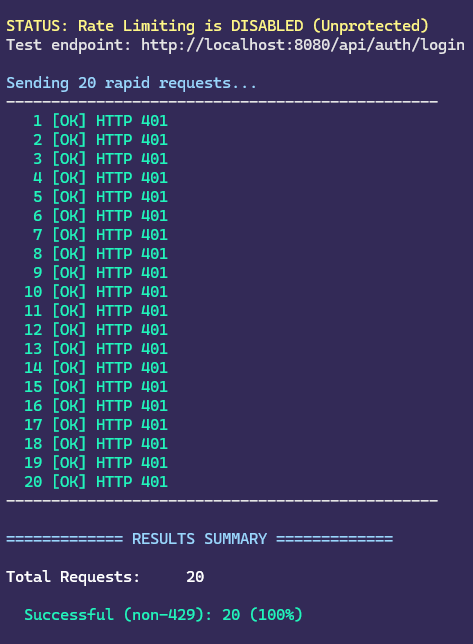
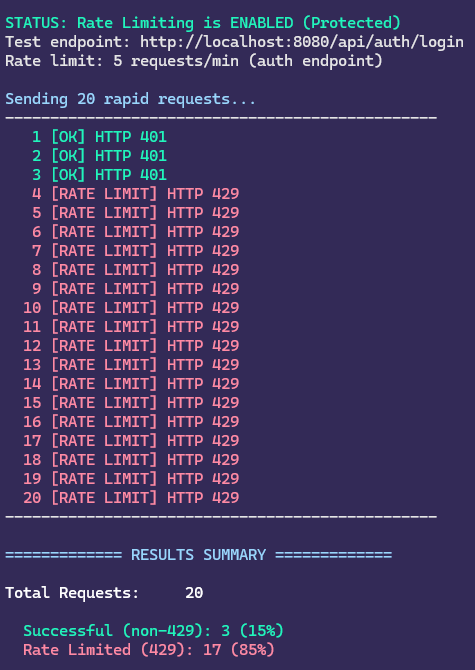
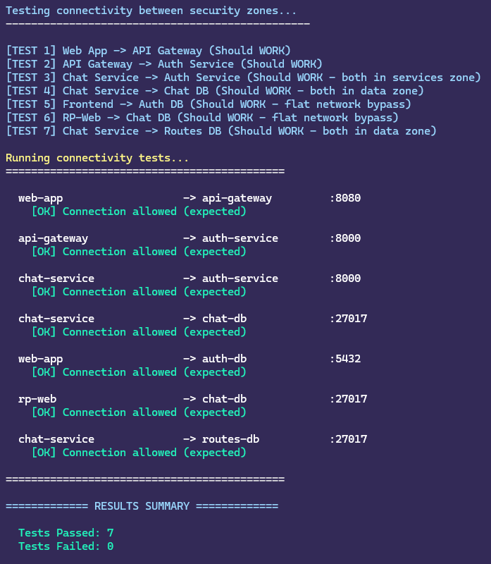
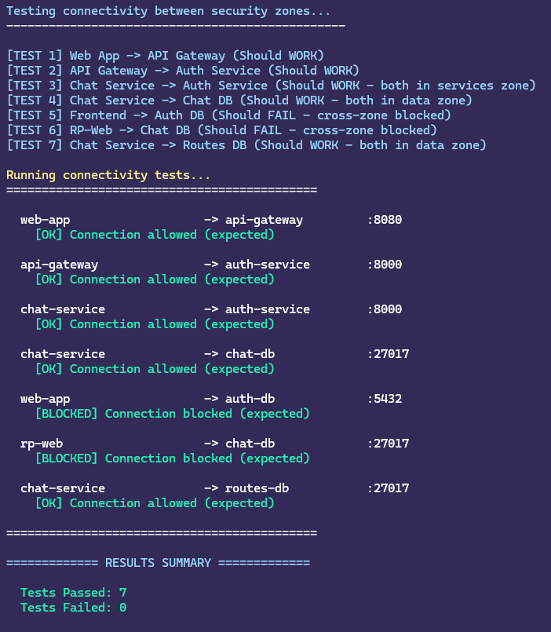
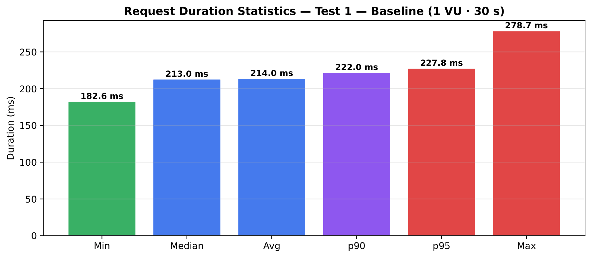
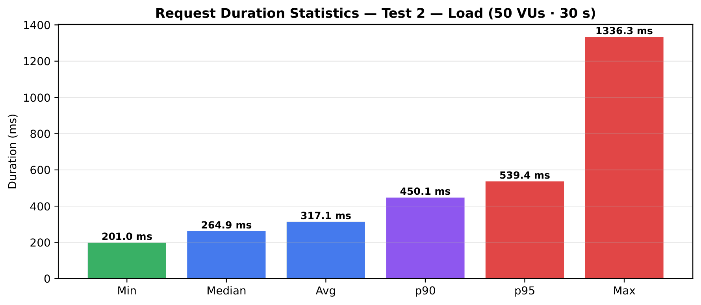
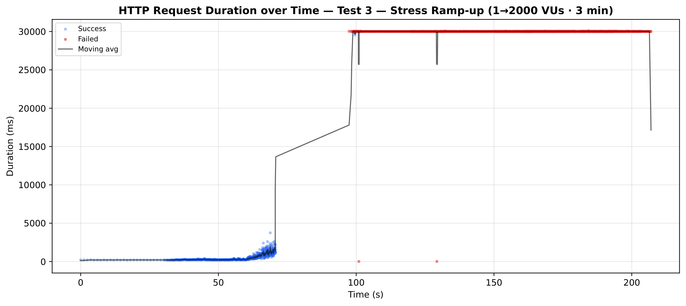
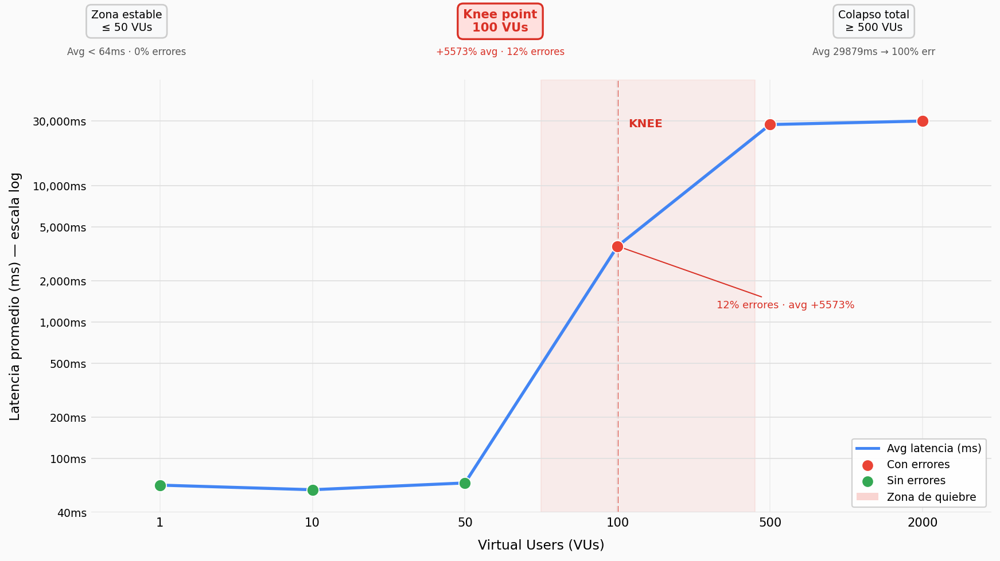

# Prototipo 3 — Atributos De Calidad, Parte 1

**Arquitectura de Software — 2026-I**
Universidad Nacional de Colombia

---

## 1. Equipo

**Nombre del Equipo:** 2B

| Nombre Completo                |
| ------------------------------ |
| Ana María González Hernández   |
| Iván Daniel Silva Oyola        |
| Daniel Alejandro Ortiz Velosa  |
| Carlos Julián Reyes Piraligua  |
| Sergio Esteban Rendón Umbarila |
| Sergio Alejandro Ruiz Hurtado  |
| Cristian Javier Medina Barrios |
| Camilo Andrés Liévano Rendón   |

---

## 2. Sistema de Software

### Nombre

**UN Wheels**

### Logo

<div align="center">


</div>

### Descripción

UN Wheels es una plataforma de movilidad compartida diseñada para la comunidad universitaria de la Universidad Nacional de Colombia. Conecta estudiantes conductores con estudiantes pasajeros dentro de un ecosistema cerrado y verificado mediante correo institucional (`@unal.edu.co`), centralizando la publicación y gestión de rutas compartidas que hoy ocurren de forma dispersa en plataformas externas como WhatsApp o grupos de Facebook.

El sistema permite a los conductores publicar rutas con horario, paradas, precio por asiento y cupos disponibles, mientras que los pasajeros pueden buscar rutas, reservar cupos y comunicarse directamente con el conductor mediante chat en tiempo real. El modelo se basa en un **usuario único con roles dinámicos**: cualquier estudiante actúa como pasajero por defecto, y al registrar un vehículo adquiere la capacidad de conductor. Las reservas incluyen control de concurrencia para garantizar que no se sobrevendan los cupos.

La arquitectura sigue un patrón de microservicios distribuidos con cinco lenguajes de programación de propósito general distintos (TypeScript, Python, JavaScript, Go, Dart), cinco componentes de tipo lógico, un API Gateway para el tráfico norte-sur, un broker de mensajes (RabbitMQ) para la comunicación este-oeste y la orquestación asíncrona entre servicios, y cinco componentes de tipo datos que incluyen bases de datos relacionales y NoSQL. Todo el sistema se despliega como contenedores Docker orquestados mediante Docker Compose.

---

## 3. Estructuras Arquitectónicas

### 3.1 Estructura de Componentes y Conectores (C&C)

#### Vista C&C

<div align="center">


</div>

#### Descripción de Elementos Arquitectónicos y Relaciones

#### Componentes

**Capa Edge**

Es la única zona expuesta al mundo exterior (Internet/Host). Aloja los Reverse Proxies, que fungen simultáneamente como enrutadores y firewalls perimetrales (ModSecurity + OWASP CRS embebido).

| Componente    | Puerto | Descripción                                                                                                                                                                                                                                                                                                                                 |
| ------------- | ------ | ------------------------------------------------------------------------------------------------------------------------------------------------------------------------------------------------------------------------------------------------------------------------------------------------------------------------------------------- |
| **rp-web**    | 8080   | Reverse proxy dedicado al cliente web. Enruta el tráfico de páginas hacia el frontend y las conexiones WebSocket directamente al API Gateway. Posee políticas de seguridad flexibles adaptadas a navegadores (ej. permite cargas de hasta 10 MB y admite contenido multipart/form-data para subida de imágenes) e implementa Rate Limiting. |
| **rp-mobile** | 8081   | Reverse proxy dedicado a la aplicación móvil. Enruta el tráfico exclusivamente hacia el API Gateway. Posee un perfil de seguridad sumamente estricto, diseñado para una API pura (límite de carga de 5 MB y aceptación exclusiva de peticiones en formato JSON).                                                                            |

**Capa Web-Zone**

| Componente            | Tecnología | Lenguaje   | Descripción                                                                                                                                                                                                                       |
| --------------------- | ---------- | ---------- | --------------------------------------------------------------------------------------------------------------------------------------------------------------------------------------------------------------------------------- |
| **unwheels-frontweb** | NextJS     | TypeScript | Aplicación encargada del renderizado del lado del servidor (SSR) y de la interfaz de usuario web. Reside en una red aislada a la que solo el rp-web tiene acceso, impidiendo la comunicación directa desde cualquier otra fuente. |

**Capa Gateway-Zone**

| Componente               | Tecnología | Lenguaje   | Descripción                                                                                                                                                                                                                                                                              |
| ------------------------ | ---------- | ---------- | ---------------------------------------------------------------------------------------------------------------------------------------------------------------------------------------------------------------------------------------------------------------------------------------- |
| **unwheels-api-gateway** | NodeJS     | TypeScript | Orquestador principal de la API. Coordina, enruta y consolida las peticiones recibidas hacia los microservicios correspondientes. Recibe tráfico validado directamente desde rp-mobile, solicitudes internas desde el unwheels-front-web, y conexiones WebSocket enviadas por el rp-web. |

**Capa Services**

| Componente                 | Tecnología                                   | Lenguaje             | Puerto | Descripción                                                                                                                                                                                                                                                                |
| -------------------------- | -------------------------------------------- | -------------------- | ------ | -------------------------------------------------------------------------------------------------------------------------------------------------------------------------------------------------------------------------------------------------------------------------- |
| **unwheels-auth**          | FastAPI + SQLAlchemy + Pydantic v2 + Uvicorn | Python 3.x           | 8000   | Autenticación, registro de usuarios (validando dominio `@unal.edu.co`), emisión y validación de JWT, y gestión de perfiles y vehículos. Es el único servicio que emite tokens JWT.                                                                                         |
| **unwheels-routes**        | Express.js + Mongoose                        | JavaScript (Node.js) | 4000   | Gestión del ciclo de vida completo de rutas y reservas: creación, consulta, control de concurrencia para cupos, y transiciones de estado de reservas (PENDING → CONFIRMED / REJECTED). Publica eventos de dominio en RabbitMQ al completar operaciones de negocio.         |
| **unwheels-chat**          | NestJS + Socket.IO + Mongoose                | TypeScript (Node.js) | 3001   | Mensajería bidireccional en tiempo real entre conductores y pasajeros. Expone un Gateway Socket.IO para mensajería en tiempo real y un Controller HTTP para consultar historial y listar conversaciones. Publica eventos `chat.message` en RabbitMQ.                       |
| **unwheels-notifications** | NestJS + Socket.IO + Mongoose                | TypeScript (Node.js) | 3002   | Consumidor de eventos asíncronos de RabbitMQ. Persiste notificaciones en MongoDB y las entrega en tiempo real vía WebSocket (Socket.IO, namespace `/notifications`). Actúa como puente AMQP↔WebSocket dentro del mismo proceso.                                            |
| **unwheels-search**        | Gin + pgx/v5                                 | Go                   | 6000   | Búsqueda geoespacial de rutas disponibles. Mantiene un índice de lectura optimizada en PostgreSQL+PostGIS, sincronizado periódicamente con unwheels-routes mediante polling HTTP. Expone un único endpoint público que acepta consultas de texto libre y radio geográfico. |

**Componente de Orquestación**

| Componente            | Tecnología                                              | Descripción                                                                                                                                                                                                                                                                            |
| --------------------- | ------------------------------------------------------- | -------------------------------------------------------------------------------------------------------------------------------------------------------------------------------------------------------------------------------------------------------------------------------------- |
| **unwheels-rabbitmq** | RabbitMQ 3.13 (puertos 5672 AMQP / 15672 Management UI) | Broker de mensajes para comunicación asíncrona este-oeste entre microservicios. Utiliza un topic exchange durable (`uniwheels.events`) con routing keys para enrutamiento de eventos. Habilita el patrón Publish-Subscribe con desacoplamiento total entre productores y consumidores. |

**Componentes de Datos**

| Componente           | Tipo                                      | Usado por              | Descripción                                                                                                                                         |
| -------------------- | ----------------------------------------- | ---------------------- | --------------------------------------------------------------------------------------------------------------------------------------------------- |
| **auth-db**          | PostgreSQL 16 (Relacional)                | unwheels-auth          | Almacena usuarios y vehículos con integridad referencial. Transacciones ACID. Accedido mediante SQLAlchemy ORM.                                     |
| **routes-db**        | MongoDB 7 (Documental)                    | unwheels-routes        | Almacena rutas, reservas y reglas de disponibilidad (SPECIFIC_DATES, WEEKLY_RECURRENCE) con esquemas flexibles. Accedido mediante Mongoose.         |
| **chat-db**          | MongoDB 7 (Documental)                    | unwheels-chat          | Almacena conversaciones y mensajes en formato append-only. Accedido mediante Mongoose.                                                              |
| **notifications-db** | MongoDB 7 (Documental)                    | unwheels-notifications | Almacena historial de notificaciones con TTL de 30 días e índice compuesto por destinatario. Accedido mediante Mongoose.                            |
| **search-db**        | PostgreSQL 16 + PostGIS 3.4 (Geoespacial) | unwheels-search        | Proyección de lectura de rutas con columnas GEOGRAPHY para consultas espaciales eficientes (`ST_DWithin`, `ST_Distance`). Accedido mediante pgx/v5. |

#### Conectores (Relaciones)

**Conectores HTTP (Cliente ↔ Gateway ↔ Servicios)**

| Conector                                    | Tipo                    | Protocolo      | Endpoints                                                 | Dirección                                                                                 |
| ------------------------------------------- | ----------------------- | -------------- | --------------------------------------------------------- | ----------------------------------------------------------------------------------------- |
| Cliente Web → Reverse Proxy Web (WAF)       | Llamada a Procedimiento | HTTPS          | `security/reverse-proxies/rp-web/`                        | Bidireccional: Cliente (Navegador Web) → rp-web                                           |
| Cliente Mobile → Reverse Proxy Mobile (WAF) | Llamada a Procedimiento | HTTPS          | `security/reverse-proxies/rp-mobile/`                     | Bidireccional: Cliente (App Mobile) → rp-mobile                                           |
| Cliente Web → Gateway (WebSocket bypass)    | Evento                  | WSS            | `/api/`                                                   | Bidireccional: Cliente (Navegador Web) → Gateway                                          |
| Reverse Proxy Web → Frontend Web            | Proxy HTTP Interno      | HTTP           | `security/reverse-proxies/rp-web/`                        | Unidireccional: rp-web → Frontend SSR Container                                           |
| Frontend Web → API Gateway                  | Llamada a Procedimiento | HTTP REST      | `/api/`                                                   | Bidireccional: Frontend → Gateway                                                         |
| Reverse Proxy Mobile → API Gateway          | Proxy HTTP Seguro       | HTTP REST      | `security/reverse-proxies/rp-mobile/`, `/api/`            | Bidireccional: rp-mobile → Gateway                                                        |
| REST (Auth)                                 | Llamada a Procedimiento | HTTP/JSON      | `/api/auth/*`                                             | Bidireccional: Cliente → Gateway → unwheels-auth                                          |
| REST (Routes)                               | Llamada a Procedimiento | HTTP/JSON      | `/api/routes/*`, `/api/reservations/*`, `/api/vehicles/*` | Bidireccional: Cliente → Gateway → unwheels-routes                                        |
| REST (Notifications)                        | Llamada a Procedimiento | HTTP/JSON      | `/api/notifications/*`                                    | Bidireccional: Cliente → Gateway → unwheels-notifications                                 |
| REST (Search)                               | Llamada a Procedimiento | HTTP/JSON      | `/api/search/*`                                           | Bidireccional: Cliente → Gateway → unwheels-search                                        |
| REST (Chat HTTP)                            | Llamada a Procedimiento | HTTP/JSON      | `/api/chat/*`                                             | Bidireccional: Cliente → Gateway → unwheels-chat                                          |
| WebSocket/Socket.IO (Chat)                  | Evento                  | WS + Socket.IO | `/api/chat/socket.io`                                     | Bidireccional: Cliente ↔ Gateway (proxy) ↔ unwheels-chat (namespace `/`)                  |
| WebSocket/Socket.IO (Notif.)                | Evento                  | WS + Socket.IO | `/api/notifications/socket.io`                            | Servidor → Cliente: Gateway (proxy) ↔ unwheels-notifications (namespace `/notifications`) |

**Conectores de Message Broker (Servicio ↔ RabbitMQ)**

| Conector                  | Tipo                             | Protocolo  | Routing Keys                                                            | Publicador → Consumidor                                      |
| ------------------------- | -------------------------------- | ---------- | ----------------------------------------------------------------------- | ------------------------------------------------------------ |
| AMQP (Eventos de Reserva) | Unidireccional: Evento (Pub/Sub) | AMQP 0.9.1 | `reservation.requested`, `reservation.accepted`, `reservation.rejected` | unwheels-routes → unwheels-rabbitmq → unwheels-notifications |
| AMQP (Eventos de Ruta)    | Unidireccional: Evento (Pub/Sub) | AMQP 0.9.1 | `route.deleted`                                                         | unwheels-routes → unwheels-rabbitmq → unwheels-notifications |
| AMQP (Eventos de Chat)    | Unidireccional: Evento (Pub/Sub) | AMQP 0.9.1 | `chat.message`                                                          | unwheels-chat → unwheels-rabbitmq → unwheels-notifications   |

**Conectores de Acceso a Datos**

| Conector                         | Tipo                    | Tecnología          | Componentes                                                                     |
| -------------------------------- | ----------------------- | ------------------- | ------------------------------------------------------------------------------- |
| db_connector_relational          | Acceso a Datos          | SQLAlchemy (Python) | unwheels-auth → auth-db                                                         |
| db_connector_documental (routes) | Acceso a Datos          | Mongoose (Node.js)  | unwheels-routes → routes-db                                                     |
| db_connector_documental (chat)   | Acceso a Datos          | Mongoose (Node.js)  | unwheels-chat → chat-db                                                         |
| db_connector_documental (notif.) | Acceso a Datos          | Mongoose (Node.js)  | unwheels-notifications → notifications-db                                       |
| db_connector_geoespacial         | Acceso a Datos          | pgx/v5 (Go)         | unwheels-search → search-db                                                     |
| http_polling (Search Sync)       | Llamada a Procedimiento | HTTP/JSON           | unwheels-search → unwheels-routes (sincronización periódica del índice PostGIS) |

#### Descripción de Estilos y Patrones Arquitectónicos

| Estilo / Patrón                 | Aplicación en UN Wheels                                                                                                                                                                                                                                                                                         |
| ------------------------------- | --------------------------------------------------------------------------------------------------------------------------------------------------------------------------------------------------------------------------------------------------------------------------------------------------------------- |
| **Microservicios**              | Cinco componentes lógicos independientes (auth, routes, chat, notifications, search), cada uno con su propio código fuente, runtime y datastore dedicado. Los servicios son desplegables de forma independiente y usan la tecnología óptima para su dominio.                                                    |
| **API Gateway**                 | NestJS actúa como punto de entrada único para todo el tráfico externo (norte-sur). Enruta peticiones, centraliza la validación JWT, gestiona cookies HttpOnly y realiza proxy transparente de WebSocket. Los clientes no conocen la topología interna.                                                          |
| **Publish-Subscribe**           | RabbitMQ habilita la comunicación asíncrona (tráfico este-oeste) entre microservicios. Los servicios productores publican eventos de dominio en el topic exchange `uniwheels.events`; el consumidor (notifications) se suscribe con bindings comodín. Esto desacopla completamente productores de consumidores. |
| **Bridge AMQP↔WebSocket**       | unwheels-notifications actúa como puente entre dos protocolos: consume eventos AMQP del broker y los entrega en tiempo real vía Socket.IO al cliente. Ambas interfaces conviven en el mismo proceso, reduciendo la latencia a ≈10–15 ms entre cola y navegador.                                                 |
| **Server-Side Rendering (SSR)** | El frontend web usa Next.js 15 para renderizar páginas en el servidor. El middleware SSR valida la cookie HttpOnly antes de renderizar rutas protegidas, sin exponer el JWT al navegador.                                                                                                                       |
| **Database per Service**        | Cada microservicio posee sus propios datos en una base de datos independiente: auth → PostgreSQL, routes / chat / notifications → MongoDB ×3, search → PostgreSQL+PostGIS. No existe compartición directa de bases de datos entre servicios.                                                                    |
| **SOFEA**                       | El backend nunca genera HTML; solo sirve JSON. Esto permite que el frontend web y el frontend móvil evolucionen de forma independiente sobre la misma superficie de API sin duplicar lógica de backend.                                                                                                         |

---

### 3.2 Estructura de Despliegue

#### Vista de Despliegue

<div align="center">


</div>

#### Descripción de Elementos Arquitectónicos y Relaciones

El sistema se despliega en un único nodo Docker Host (LAN PC) ejecutando Docker Engine con Docker Compose para la orquestación de contenedores. La arquitectura introduce una **Edge Zone** con proxies inversos Nginx como capa de entrada diferenciada por canal (web y móvil). El despliegue se organiza en cinco zonas:

##### Zona Móvil (LAN-mobile)

| Elemento de Despliegue | Runtime                                 | Descripción                                                                                                                                                                      |
| ---------------------- | --------------------------------------- | -------------------------------------------------------------------------------------------------------------------------------------------------------------------------------- |
| unwheels-front-mobile  | Flutter / Dart VM sobre Android (Linux) | Aplicación nativa ejecutada en el smartphone del usuario. Se comunica con el backend a través del reverse proxy móvil (`rp-mobile`) por HTTP/REST y WebSocket en el puerto 8081. |

##### Edge Zone (puertos expuestos al host)

| Elemento de Despliegue | Contenedor             | Runtime | Puerto                          | Descripción                                                                                                                                                        |
| ---------------------- | ---------------------- | ------- | ------------------------------- | ------------------------------------------------------------------------------------------------------------------------------------------------------------------ |
| rp-web                 | `reverse-proxy-web`    | Nginx   | 8080 (host) → 8080 (contenedor) | Punto de entrada del tráfico web. Recibe peticiones del navegador y las enruta hacia el frontend web (puerto 3000) o hacia el `api-gateway` (puerto 8080 interno). |
| rp-mobile              | `reverse-proxy-mobile` | Nginx   | 8081 (host) → 8081 (contenedor) | Punto de entrada exclusivo del tráfico móvil. Recibe peticiones de la app Flutter y las enruta hacia el `api-gateway`.                                             |

##### Web Zone (red interna Docker)

| Elemento de Despliegue | Contenedor | Runtime                      | Puerto (interno) | Descripción                                                                        |
| ---------------------- | ---------- | ---------------------------- | ---------------- | ---------------------------------------------------------------------------------- |
| unwheels-front-web     | `web-app`  | Node.js (Next.js standalone) | 3000             | Servidor Next.js SSR. Accesible desde el exterior únicamente a través de `rp-web`. |

##### Gateway Zone (red interna Docker)

| Elemento de Despliegue | Contenedor    | Runtime          | Puerto (interno) | Descripción                                                                                                                                                                                    |
| ---------------------- | ------------- | ---------------- | ---------------- | ---------------------------------------------------------------------------------------------------------------------------------------------------------------------------------------------- |
| unwheels-api-gateway   | `api-gateway` | Node.js (NestJS) | 8080             | Enrutador central de tráfico backend. Valida JWT, enruta peticiones a los microservicios de negocio y gestiona conexiones WebSocket. Solo accesible desde los reverse proxies de la Edge Zone. |

##### Services Zone (red interna Docker)

| Elemento de Despliegue | Contenedor              | Runtime                        | Puerto (interno) |
| ---------------------- | ----------------------- | ------------------------------ | ---------------- |
| unwheels-auth          | `auth-service`          | Python 3.x / Uvicorn (FastAPI) | 8000             |
| unwheels-routes        | `routes-service`        | Node.js (Express)              | 4000             |
| unwheels-chat          | `chat-service`          | Node.js (NestJS)               | 3001             |
| unwheels-notifications | `notifications-service` | Node.js (NestJS)               | 3002             |
| unwheels-search        | `routes-search-service` | Go / Gin (contenedor Linux)    | 6000             |

##### Data Zone (red interna Docker)

| Elemento de Despliegue | Contenedor         | Runtime                   | Puerto (interno) |
| ---------------------- | ------------------ | ------------------------- | ---------------- |
| unwheels-rabbitmq      | `event-broker`     | RabbitMQ 3.13 (Erlang VM) | 5672 (AMQP)      |
| auth-db                | `auth-db`          | PostgreSQL 16             | 5432             |
| search-db              | `search-db`        | PostgreSQL 16 + PostGIS   | 5432             |
| chat-db                | `chat-db`          | MongoDB 7                 | 27017            |
| notifications-db       | `notifications-db` | MongoDB 7                 | 27017            |
| routes-db              | `routes-db`        | MongoDB 7                 | 27017            |

#### Relaciones de Despliegue

- El tráfico web ingresa por `rp-web` (puerto 8080 del host), que lo enruta hacia `web-app` (puerto 3000) o hacia `api-gateway` (puerto 8080 interno) según la ruta.
- El tráfico móvil ingresa exclusivamente por `rp-mobile` (puerto 8081 del host), que lo enruta hacia `api-gateway`.
- El `api-gateway` no está expuesto directamente al host; solo es alcanzable desde los contenedores de la Edge Zone.
- Todos los contenedores de las zonas internas (Web, Gateway, Services y Data) se comunican a través de la red bridge Docker mediante DNS interno basado en nombres de contenedor.
- El `api-gateway` depende de que `auth-service`, `chat-service`, `routes-service` y `notifications-service` estén saludables antes de iniciar (`depends_on: condition: service_healthy`).
- Los proxies inversos (`rp-web`, `rp-mobile`) dependen de que `api-gateway` esté saludable.
- Los microservicios de negocio dependen de sus respectivos datastores y, cuando aplica, de `event-broker`.
- Los datos persistentes se almacenan en volúmenes Docker: `mongodb_data`, `rabbitmq_data` y `postgres_data`.

#### Descripción de Patrones Arquitectónicos

| Patrón                              | Aplicación                                                                                                                                                                                                                                                                         |
| ----------------------------------- | ---------------------------------------------------------------------------------------------------------------------------------------------------------------------------------------------------------------------------------------------------------------------------------- |
| **Containerización**                | Cada componente se empaqueta como una imagen Docker con su propio Dockerfile. Garantiza despliegues reproducibles, aislados y portables entre entornos.                                                                                                                            |
| **Dual Reverse Proxy (Edge Zone)**  | Dos instancias Nginx separan el canal web (puerto 8080) del canal móvil (puerto 8081) como únicos puntos de entrada al sistema. Esto permite políticas de enrutamiento, TLS y rate-limiting diferenciadas por tipo de cliente sin exponer directamente ningún servicio de negocio. |
| **Aislamiento de Red Interna**      | La red bridge Docker `unwheels_default` aísla los servicios internos. Los proxies de la Edge Zone son los únicos contenedores con puertos publicados al host; el resto solo hace `expose`.                                                                                         |
| **Database per Service**            | Cada microservicio tiene su propia instancia de base de datos en un contenedor independiente con su propio volumen Docker. Ningún par de servicios comparte base de datos, garantizando acoplamiento débil en la capa de datos.                                                    |
| **Health Check + Dependency Order** | Todos los contenedores definen healthchecks en `docker-compose.yml`. Docker Compose los usa para garantizar el orden de arranque, evitando condiciones de carrera donde un servicio intenta conectarse a un recurso aún no disponible.                                             |
| **Despliegue en Nodo Único**        | Para este prototipo, todos los contenedores se ejecutan en un único Docker Host mediante Docker Compose. La zonificación de la arquitectura (Edge / Web / Gateway / Services / Data) está diseñada para migrar a orquestadores como Kubernetes con mínimo refactoring.             |

---

### 3.3 Estructura en Capas

#### Vista en Capas

<div align="center">


</div>


#### Descripción de elementos arquitectónicos y relaciones

La vista organiza el sistema en 7 tiers, desde el punto de entrada público hasta la persistencia de datos:

| Tier | Componente(s) | Tecnología | Responsabilidad |
| ---- | ------------- | ---------- | --------------- |
| **Seguridad** | `rp-web` | nginx:1.27-alpine | Único punto de entrada público para tráfico web; combina reverse proxy y WAF. |
| **Presentación** | `unwheels-front-web`, `unwheels-front-mobile` | Next.js, Flutter/Dart | Clientes web (SSR) y móvil; se comunican con el backend a través del API Gateway. |
| **Edge** | `rp-mobile` | nginx:1.27-alpine | Reverse proxy dedicado al tráfico móvil; oculta el API Gateway del exterior. |
| **Integración** | `unwheels-api-gateway` | NestJS | Punto de entrada unificado del backend; enruta peticiones y aplica políticas de autenticación/autorización. |
| **Lógica** | `unwheels-auth`, `unwheels-routes`, `unwheels-chat`, `unwheels-notifications`, `unwheels-search` | FastAPI, Express, NestJS ×2, Go/Gin | Microservicios de negocio, cada uno con arquitectura de capas interna propia. |
| **Comunicación Asíncrona** | `unwheels-rabbitmq` | RabbitMQ | Broker de mensajes que desacopla al productor (`unwheels-routes`) del consumidor (`unwheels-notifications`). |
| **Datos** | `auth-db`, `routes-db`, `chat-db`, `notifications-db`, `search-db` | PostgreSQL, MongoDB ×3, PostgreSQL+PostGIS | Persistencia por servicio; ningún microservicio comparte base de datos. |

**Estructura interna de capas — Tier de Lógica:**

| Servicio | Capa | Responsabilidad |
| -------- | ---- | --------------- |
| **unwheels-auth** (FastAPI) | Endpoints | Expone los endpoints REST para login, validación de token y gestión de usuarios. |
| | Schemas/DTOs | Define esquemas de datos y objetos de transferencia entre capas. |
| | CRUD | Operaciones de lectura/escritura sobre `auth-db` (PostgreSQL). |
| | Models/DB | Modelos de datos y conexión directa con la base de datos. |
| **unwheels-routes** (Express) | Routes | Define las rutas HTTP y dirige peticiones a los controladores. |
| | Controllers | Recibe y valida peticiones HTTP, delega a la capa de servicios. |
| | Services | Lógica de negocio para rutas, control de cupos y reservas. |
| | Models | Modelos de datos y conexión con `routes-db` (MongoDB). |
| **unwheels-chat** (NestJS) | Socket.IO + HTTP | Gestiona conexiones WebSocket entrantes y peticiones HTTP. |
| | Service | Lógica de negocio del chat: envío, recepción y gestión de mensajes. |
| | Repositories + Interfaces | Abstrae el acceso a datos del chat. |
| | Schemas | Esquemas Mongoose y conexión con `chat-db` (MongoDB). |
| **unwheels-notifications** (NestJS) | RabbitMQ | Consumo asíncrono de eventos de notificación mediante AMQP. |
| | Handlers | Procesa eventos de RabbitMQ y determina la acción a ejecutar. |
| | Controller (HTTP) | Gestiona peticiones HTTP directas al servicio. |
| | Service | Coordina la lógica de entrega de notificaciones. |
| | Socket.IO | Entrega notificaciones en tiempo real vía WebSocket. |
| | Schema/DB | Esquemas y conexión con `notifications-db` (MongoDB). |
| **unwheels-search** (Go/Gin) | Cmd | Inicializa la aplicación Go y configura el servidor Gin. |
| | Handler | Recibe y valida peticiones HTTP de búsqueda. |
| | Sync | Lógica geoespacial y sincronización de datos con `unwheels-routes`. |
| | Repository | Abstrae el acceso a la base de datos geoespacial. |
| | Model/DB | Modelos de datos y conexión con `search-db` (PostgreSQL+PostGIS). |

**Relaciones entre tiers:**

| Flujo | Ruta | Protocolo |
| ----- | ---- | --------- |
| Web | `rp-web` → `unwheels-front-web` → `unwheels-api-gateway` | HTTPS / HTTP REST |
| Móvil | `unwheels-front-mobile` → `rp-mobile` → `unwheels-api-gateway` | HTTPS / HTTP REST |
| Backend | `unwheels-api-gateway` → [auth, routes, chat, notifications, search] | HTTP REST / WebSocket |
| Asíncrono | `unwheels-routes` → `unwheels-rabbitmq` → `unwheels-notifications` | AMQP |
| Datos | Cada microservicio → su propia base de datos | ORM / driver nativo |

#### Descripción de patrones arquitectónicos utilizados

| Patrón | Aplicación en UN Wheels |
| ------ | ----------------------- |
| **Arquitectura en Capas** | Todos los microservicios separan claramente las responsabilidades de entrada, dominio/negocio, acceso a datos y persistencia, promoviendo modularidad y testabilidad independiente. |
| **Database per Service** | Cada microservicio posee su propia base de datos aislada: MongoDB para routes, chat y notifications; PostgreSQL/PostGIS para search; PostgreSQL para auth. Ningún par de servicios comparte almacenamiento. |
| **Publish-Subscribe (Message Broker)** | RabbitMQ desacopla `unwheels-routes` (productor) de `unwheels-notifications` (consumidor), permitiendo que la finalización de una reserva dispare notificaciones asíncronas sin bloquear la transacción principal. |
| **Event-Driven interno (Socket.IO Gateway)** | `unwheels-chat` y `unwheels-notifications` implementan internamente una arquitectura orientada a eventos usando Socket.IO para la entrega reactiva de mensajes y notificaciones en tiempo real a los clientes conectados. |

### 3.4 Estructura de Descomposición

#### Vista de Descomposición

<div align="center">


</div>

#### Descripción de Elementos Arquitectónicos y Relaciones

El sistema se descompone en siete módulos funcionales, cada uno responsable de un conjunto cohesivo de funcionalidades:

| Módulo                        | Submódulos                                    | Funcionalidades Hoja                                                                                                                                                                                                                                                                          |
| ----------------------------- | --------------------------------------------- | --------------------------------------------------------------------------------------------------------------------------------------------------------------------------------------------------------------------------------------------------------------------------------------------- |
| **Autenticación e Identidad** | Cuentas, Sesión                               | Registrar usuario (validando `@unal.edu.co`); Iniciar sesión (emitir JWT); Cerrar sesión; Validar token JWT en cada solicitud.                                                                                                                                                                |
| **Gestión de Perfil**         | Perfil propio, Perfil público                 | Leer y actualizar datos personales (nombre, teléfono, carrera, edad); Leer perfil público de otro usuario.                                                                                                                                                                                    |
| **Gestión de Vehículos**      | CRUD de vehículos                             | Registrar nuevo vehículo; Listar vehículos propios; Consultar detalle; Eliminar vehículo registrado.                                                                                                                                                                                          |
| **Gestión de Rutas**          | Publicación, Disponibilidad, Descubrimiento   | Crear/actualizar/eliminar rutas propias; Agregar/eliminar reglas de disponibilidad (fechas específicas o recurrencia semanal); Vista de calendario de cupos; Buscar rutas por filtros (origen, destino, fecha, radio geográfico); Ver detalle enriquecido con datos del conductor y vehículo. |
| **Reservaciones**             | Acciones del Pasajero, Acciones del Conductor | Solicitar asiento; Cancelar reserva propia; Ver historial de viajes; Listar solicitudes pendientes del conductor; Aceptar/rechazar solicitudes de reserva.                                                                                                                                    |
| **Mensajería en Tiempo Real** | Conversaciones, Mensajes                      | Crear conversación conductor↔pasajero vinculada a una ruta; Listar conversaciones con último mensaje; Enviar y recibir mensajes en tiempo real (WebSocket); Consultar historial paginado.                                                                                                     |
| **Notificaciones**            | Alertas, Historial                            | Recibir notificaciones en tiempo real (WebSocket); Consultar historial paginado; Ver contador de no leídas; Marcar como leídas (individual o todas).                                                                                                                                          |

**Relaciones entre módulos:**

- **Autenticación e Identidad** es un módulo transversal: todos los demás módulos dependen de él para identificar y autorizar al usuario en cada operación.
- **Gestión de Rutas → Reservaciones:** La creación de una reserva requiere que exista una ruta con cupos disponibles; la eliminación de una ruta cancela en cascada las reservas asociadas.
- **Reservaciones → Notificaciones:** Los cambios de estado de una reserva (aceptada, rechazada) desencadenan notificaciones automáticas al pasajero vía RabbitMQ.
- **Mensajería en Tiempo Real → Notificaciones:** Cuando se envía un mensaje a un usuario desconectado, se genera una notificación persistente vía RabbitMQ.
- **Gestión de Rutas → Búsqueda (Descubrimiento):** El servicio de búsqueda sincroniza periódicamente su índice PostGIS con los datos de rutas activas del módulo de Gestión de Rutas.

---

## 4. Atributos de Calidad — Seguridad

### 4.1 Escenarios de Seguridad

#### Escenario 1 – Interceptación No Autorizada y Compromiso del Enlace de Red

El sistema protege el canal entre los clientes y la capa de presentación para impedir captura, manipulación o suplantación del tráfico en tránsito. Este escenario se presenta cuando un usuario de la comunidad universitaria accede desde una red no confiable y envía credenciales, coordenadas geográficas o eventos de chat a través del frontend web o de la aplicación móvil. Un atacante ubicado en la ruta de comunicación podría intentar leer la cookie `access_token`, forzar un _downgrade_ de TLS, alterar las respuestas del sistema o inyectar contenido falso que afecte la autenticación, la consulta de rutas o la reserva de cupos. Por ello, el canal debe mantenerse cifrado de extremo a extremo y con validación estricta de la sesión para preservar la confidencialidad e integridad de los datos.


_Descripción del Escenario_

- **Source:** Un atacante pasivo o activo ubicado en una red no confiable, como una Wi-Fi compartida, un segmento del ISP o un nodo intermedio comprometido, que intenta observar o alterar el tráfico entre el usuario y la plataforma.
- **Stimulus:** Intentos de realizar *sniffing*, *man-in-the-middle* o *downgrade attacks* durante el intercambio de autenticación, búsqueda de rutas, reserva de cupos o mensajería en tiempo real con el frontend.
- **Artifact:** Canal de comunicación HTTPS/WSS entre el cliente web o móvil y la capa de presentación, incluyendo credenciales, tokens de sesión, coordenadas geográficas y eventos de chat.
- **Environment:** Operación normal del sistema en producción. Los usuarios acceden desde redes domésticas, móviles o universitarias mientras el frontend atiende solicitudes que requieren autenticación y transporte seguro de datos sensibles.
- **Response:** El sistema obliga el uso de HTTPS y WSS, rechaza HTTP o WS plano y también niega versiones débiles de TLS. La cookie `access_token` se emite con `HttpOnly`, `Secure` y `SameSite=Lax`, y los datos sensibles viajan únicamente dentro del payload cifrado.
- **Response measure:** El tráfico interceptado no es legible ni reutilizable, los intentos de manipulación son rechazados y ninguna sesión válida puede ser recuperada desde capturas de red. No se exponen tokens, coordenadas ni datos de reserva en texto claro.

_Conceptos de Seguridad_

- **Debilidad:** Los enlaces de red entre cliente y sistema pueden ser observados o manipulados en redes compartidas o no confiables.
- **Vulnerabilidad:** Si el canal permitiera HTTP/WS plano o TLS débil (o existiera _downgrade_), un atacante podría leer o alterar contenido en tránsito.
- **Riesgo (Confidencialidad/Integridad):** Exposición de tokens de sesión y datos sensibles (ubicación, reservas) o inyección de respuestas falsas que afecten el estado del sistema.
- **Amenaza:** Actor con capacidad de interceptación (MITM) en Wi-Fi pública/ISP/nodo intermedio.
- **Ataque:** _Sniffing_, _SSL stripping_ y manipulación de mensajes durante el intercambio cliente↔frontend.
- **Contramedida:** Secure Channel (HTTPS/WSS + TLS fuerte) con rechazo de tráfico plano, HSTS y políticas de cookies (HttpOnly/Secure/SameSite) para reducir robo de sesión.

_Componentes involucrados_

- **Cliente web y aplicación móvil:** generan el tráfico que debe viajar cifrado hacia la plataforma.
- **rp-web:** asegura el canal público del cliente web y enruta el tráfico hacia el frontend o el gateway.
- **unwheels-front-web:** recibe las peticiones cifradas y expone la interfaz de usuario web.
- **unwheels-api-gateway:** procesa las llamadas que continúan desde el frontend hacia los microservicios del backend.

---

#### Escenario 2 – Acceso No Autorizado a Componentes Privados

El sistema expone múltiples microservicios internos que, si se publicaran directamente, ampliarían significativamente la superficie de ataque. El patrón de Reverse Proxy centraliza el punto de entrada público, ocultando la topología interna y actuando como único intermediario autorizado entre Internet y los componentes sensibles del sistema.


_Descripción del Escenario_

- **Source:** Un actor malicioso externo o un escáner automatizado operando desde Internet. Incluye herramientas de reconocimiento de puertos, bots de enumeración de endpoints y frameworks de explotación automatizada que buscan activamente servicios expuestos.
- **Stimulus:** El atacante intenta comunicarse directamente con componentes internos del sistema, como el unwheels-api-gateway, los microservicios (unwheels-auth, unwheels-routes, etc.) o las bases de datos, intentando saltarse los puntos de entrada autorizados (rp-web y rp-mobile). Realiza escaneos de puertos, enumeración de rutas y análisis de cabeceras HTTP para identificar el stack tecnológico.
- **Environment:** Operación normal del sistema. El sistema está desplegado en contenedores con redes privadas internas. El único borde expuesto hacia Internet son los reverse proxies rp-web y rp-mobile, que reciben tráfico HTTPS/WSS y lo enrutan hacia unwheels-front-web y unwheels-front-mobile respectivamente, quienes a su vez se comunican con el API Gateway.
- **Response:** El sistema rechaza cualquier petición directa hacia los componentes sensibles que no provenga del reverse proxy. Los servicios internos —unwheels-api-gateway, microservicios, broker RabbitMQ y bases de datos— no exponen puertos hacia el host ni hacia Internet. El reverse proxy además suprime o modifica las cabeceras que revelan información del stack tecnológico antes de retornar cualquier respuesta al cliente.
- **Response measure:** Los intentos de acceso directo a puertos internos son rechazados con conexión rehusada o silenciados completamente. Desde el exterior, únicamente los puertos del reverse proxy son accesibles; los demás no responden. La topología interna del sistema permanece opaca para el atacante, imposibilitando el fingerprinting de los servicios.

_Conceptos de Seguridad_

- **Weakness:** Exponer múltiples puertos y endpoints de servicios internos directamente al host incrementa la superficie de ataque y facilita el reconocimiento del sistema. Publicar directamente el API Gateway o los microservicios permitiría a un atacante identificar versiones, rutas disponibles y tecnologías empleadas sin necesidad de autenticación.
- **Vulnerability:** La publicación accidental de puertos de servicios internos (por ejemplo, el puerto del unwheels-api-gateway o de unwheels-auth) permite acceso directo y fingerprinting del stack. Adicionalmente, las cabeceras HTTP por defecto de frameworks como Express o Spring revelan información sobre versiones y tecnologías utilizadas.
- **Risk (Confidentiality/Integrity):** Un atacante que descubra la topología interna puede atacar servicios individuales sin pasar por los controles centralizados del reverse proxy, comprometiendo datos sensibles (credenciales, rutas de usuarios, información de notificaciones) o ejecutando operaciones no autorizadas sobre los microservicios del sistema.
- **Threat:** Escáneres automatizados y actores maliciosos que enumeran puertos y endpoints públicos del sistema, buscando servicios internos accesibles desde Internet para explotarlos directamente.
- **Atack:** El atacante ejecuta un escaneo de puertos sobre el host del sistema e identifica puertos internos expuestos accidentalmente. Posteriormente invoca directamente rutas sensibles como /api/auth/login, /api/routes u otras del API Gateway o microservicios, evitando los controles del reverse proxy. También analiza las cabeceras de respuesta para determinar el framework y versión del servidor, facilitando la selección de exploits específicos.
- **Countermeasure:** Implementación del patrón Reverse Proxy mediante rp-web y rp-mobile como únicos puntos de entrada públicos al sistema. Los microservicios internos, el API Gateway, las bases de datos y el broker RabbitMQ se alojan en redes privadas de contenedores sin exposición de puertos al host. El reverse proxy aplica reglas de enrutamiento tipo allow-list, suprime cabeceras reveladoras del stack y centraliza el control de acceso y validación antes de reenviar cualquier petición al interior del sistema.

_Componentes involucrados_

- **rp-web y rp-mobile:** Reverse proxies tanto para el cliente web como para el cliente móvil, expuestos públicamente en la zona edge
- **Componentes del sistema:** Los componentes restantes de presentación, de comunicación asincrónica, de datos, lógicos y de orquestración permaneción ocultos y nunca expuestos directamente, se encuentran protegidos por medio de los reverse proxies como único punto de acceso al sistema.

---

#### Escenario 3 – Exposición Pública de Componentes Críticos

Un atacante que logre comprometer u obtener un punto de apoyo inicial en un componente expuesto de la capa perimetral (Edge) o de presentación (Web) no tendrá visibilidad de red, resolución DNS ni conectividad directa hacia las bases de datos, el message broker o los microservicios privados del backend, confinando el radio de la brecha exclusivamente al contenedor vulnerado.


_Descripción del Escenario_

- **Source:** Un atacante interno o externo que ha logrado vulnerar u obtener acceso inicial a un componente periférico del sistema, como el servidor de presentación (unwheels-frontweb) o que ha tomado control de una instancia en la zona perimetral tras evadir las reglas del WAF.
- **Stimulus:** El atacante intenta realizar movimientos laterales (comunicación Este-Oeste) dentro del host de Docker para reconocer la infraestructura interna, mapear servicios ocultos (como el api-gateway) o atacar directamente las fuentes de persistencia ejecutando escaneos de puertos
- **Environment:** El sistema opera bajo una condición de compromiso parcial o localizado. El contenedor perimetral se encuentra vulnerado, mientras que el Tier de Lógica, el Tier de Integración y el Tier de Datos operan en redes privadas internas con reglas de comunicación explícitas y restrictivas.
- **Response:** La infraestructura de red de Docker (aislada en las redes independientes edge, web-zone, gateway-zone, services-zone y data-zone) deniega la comunicación directa entre componentes no adyacentes. El motor de aislamiento del host descarta los paquetes e impide la resolución de nombres DNS entre zonas distantes, neutralizando el pivoteo táctico.
- **Response measure:** El 100% de los intentos de conexión directa o escaneo de puertos originados desde un contenedor hacia una zona no adyacente fallan inmediatamente por ausencia de ruta lógica (Network unreachable). Los únicos contenedores que exponen puertos al host externo son rp-web (:8080) y rp-mobile (:8081). Ningún microservicio ni motor de base de datos posee bindings de puertos abiertos hacia el host o hacia redes fuera de su zona de datos, limitando el radio de impacto de la brecha a un valor de cero (0) componentes internos expuestos.

_Conceptos de Seguridad_

- **Weakness:** Confianza implícita en la red interna o topología plana. Confiar en que el control perimetral externo es suficiente para proteger el backend, asumiendo que los componentes internos no necesitan restricciones mutuas de visibilidad.
- **Vulnerability:** Conectividad este-oeste sin restricciones en entornos de contenedores. En un despliegue por defecto (red bridge única), cualquier vulnerabilidad de inyección de código (RCE) o Server-Side Request Forgery (SSRF) en el frontend permite que un atacante use el contenedor como puente para conectarse directamente a los puertos privados de las bases de datos o inyectar mensajes en el broker.
- **Risk (Confidentiality/Integrity):** Pérdida catastrófica de Confidencialidad e Integridad de los datos. Si la red es plana, el compromiso de la interfaz web  permite la exfiltración masiva de perfiles de usuarios, registros de rutas, historiales de chat y la manipulación ilícita de reservas, escalando un fallo de presentación en un compromiso total de la infraestructura de UN Wheels.
- **Threat:** Actores maliciosos que buscan explotar vulnerabilidades de software en la capa de cara al usuario para pivotar hacia el Core del sistema, evadiendo los mecanismos lógicos de autenticación mediante el acceso directo a los sockets de la base de datos o el secuestro de variables de entorno de otros contenedores.
- **Attack:** Movimiento lateral, reconocimiento interno y abuso de confianza de red. El atacante ejecuta binarios de escaneo (como scripts de red en bash o herramientas de escaneo TCP) desde el interior del contenedor web comprometido para descubrir las IPs internas asignadas por Docker y forzar conexiones hacia servicios del backend.
- **Countermeasure:** Countermeasure (Contramedida): Implementación del Network Segmentation Pattern mediante la segregación explícita de la infraestructura en 5 subredes lógicas aisladas de Docker:

  1. **edge:** Red pública exclusiva para recibir tráfico externo en los Reverse Proxies (rp-web y rp-mobile).

  2. **web-zone:** Canal aislado para la comunicación exclusiva entre rp-web y unwheels-frontweb.

  3. **gateway-zone:** Canal que conecta los proxies perimetrales con el api-gateway.

  4. **services-zone:** Red interna que comunica al api-gateway con el Tier de Lógica (unwheels-auth, routes-reservations-service, chat-service, notifications-service, route-search-service).

  5. **data-zone:** Compartimento estanco de máxima seguridad donde los microservicios se conectan a sus respectivas bases de datos y al broker (rabbitmq), bloqueando el acceso a cualquier componente externo a esta zona.

_Componentes involucrados_

- **rp-web y rp-mobile (Zona Edge):** Actúan como los únicos puntos de entrada perimetral expuestos públicamente hacia el host. Aíslan el tráfico externo entrante canalizándolo hacia sus respectivas zonas autorizadas (web-zone y gateway-zone), impidiendo que cualquier entidad de la red externa mapee las subredes internas del clúster.

- **unwheels-frontweb (Zona Web):** Servidor de presentación para la aplicación web SSR, confinado en una red aislada donde únicamente puede ser accedido por el proxy rp-web y solo tiene permitido comunicarse hacia el api-gateway mediante la zona de integración.

- **api-gateway (Zona Gateway):** Componente central de enrutamiento y autenticación (Tier de Integración). Está estratégicamente aislado en la gateway-zone para recibir peticiones limpias desde los proxies perimetrales y retransmitirlas a la services-zone, sirviendo como cortafuegos lógico hacia las reglas de negocio.

- **Microservicios de Lógica (Zona Services):** Comprende los servicios del sistema. Están completamente aislados del exterior dentro de la services-zone; solo pueden escuchar comandos provenientes del api-gateway y comunicarse de manera segura hacia sus respectivas fuentes persistentes en la zona de datos.

- **Almacenes de Datos y Broker (Zona Data):** Integrado por los contenedores de persistencia y el sistema de mensajería asincrónica. Es el compartimento estanco de máxima seguridad; carece de cualquier ruta o enrutamiento hacia las capas perimetrales o de presentación, respondiendo de forma exclusiva a las peticiones del microservicio que posee su propiedad dominial de datos.


---

#### Escenario 4 – Degradación o Negación del Servicio por Tráfico Excesivo


- **Source:** Atacante o bot automatizado que intenta degradar la disponibilidad del sistema. Puede provenir de una sola IP o de múltiples orígenes coordinados.
- **Stimulus:** Envío de un volumen excesivo de peticiones al frontend con el fin de saturar su capacidad de procesamiento. Se manifiesta como ráfagas de solicitudes, conexiones concurrentes y repetición de rutas costosas.
- **Artifact:** El componente unwheels-web-frontend y su punto de entrada público. En la práctica, el tráfico entra por el reverse proxy que protege este endpoint.
- **Environment:** Operación normal bajo alto tráfico de peticiones. El sistema debe distinguir entre picos legítimos y patrones anómalos sin degradar la experiencia de usuarios válidos.
- **Response:** El sistema detecta el comportamiento anómalo y bloquea la fuente de las peticiones excesivas. La mitigación ocurre en el WAF del reverse proxy antes de que el tráfico llegue al frontend.
- **Response measure:** Las peticiones provenientes de la misma dirección IP son bloqueadas cuando superan un umbral establecido en un intervalo de tiempo determinado. El bloqueo temporal y la denegación de solicitudes preservan la disponibilidad para usuarios legítimos bajo carga anómala.

- **Weakness:** Un endpoint público sin control de tasa es susceptible a saturación por volumen de solicitudes.
- **Vulnerability:** Ausencia de rate limiting, límites de conexión o filtros de WAF permite que tráfico automatizado consuma recursos del frontend.
- **Risk (Disponibilidad):** Degradación del rendimiento o caída del servicio para usuarios legítimos por agotamiento de CPU/memoria/conexiones.
- **Threat:** Bots o atacantes que generan tráfico masivo (HTTP flood) dirigido a los puntos de entrada.
- **Attack:** Envío de ráfagas concurrentes y repetidas a rutas del frontend para elevar latencia y agotar recursos.
- **Countermeasure:** WAF con rate limiting, _throttling_ y bloqueo temporal (y/o _challenge-response_) aplicado en el reverse proxy antes de llegar al frontend.

---

### 4.2 Tácticas Arquitectónicas Aplicadas

#### 1. Encrypt Data

**Descripción:** Esta táctica busca proteger la confidencialidad e integridad de los datos en tránsito mediante cifrado extremo a extremo, autenticación de entidades y verificación de la integridad de los mensajes (por ejemplo, TLS con certificados y mecanismos MAC).

**Aplicación:** Se aplica sobre el canal público entre el navegador web y el componente unwheels-web-frontend, garantizando que todas las peticiones HTTP se negocien como HTTPS (TLS). La evidencia operativa incluye certificados digitales válidos en el frontend y la negociación TLS en los puertos públicos.

**Patrón asociado:** Secure Channel Pattern.

#### 2. Limit Access

**Descripción:** Esta táctica se centra en minimizar la superficie de ataque y controlar el acceso a los recursos internos mediante intermediarios y políticas de filtrado: reducir la exposición de endpoints, imponer reglas estrictas de enrutamiento, ocultar metadatos y bloquear tráfico no autorizado antes de que alcance los servicios internos.

**Aplicación:** Se implementa en los puntos de entrada públicos (los reverse proxies que sirven a los frontends web y móvil). Estos proxies aplican reglas de enrutamiento, listas de control de acceso y filtros que sólo permiten tráfico explícitamente autorizado hacia los servicios mapeados, ocultando las direcciones internas y las cabeceras. También se evidencia en las reglas de acceso entre subredes, que restringen qué entidades pueden invocar a los servicios alojados en las redes privadas internas.

**Patrón asociado:** Reverse Proxy Pattern.

#### 3. Detect Service Denial

**Descripción:** Esta táctica busca detectar y mitigar los intentos de degradación del servicio mediante análisis de tráfico en tiempo real (detección de ráfagas, IPs sospechosas y patrones de petición anómalos) y aplicar contramedidas automáticas como rate limiting, _throttling_ de conexiones, bloqueo temporal y mecanismos _challenge-response_. El objetivo es preservar la disponibilidad para los usuarios legítimos mientras se filtra la carga maliciosa.

**Aplicación:** Se implementa en la capa WAF integrada en el proxy de entrada del frontend web, donde se monitorean continuamente las métricas de tasa de petición y las firmas de ataque. Las políticas de mitigación se ejecutan en esta capa antes de que el tráfico alcance al componente unwheels-web-frontend.

**Patrón asociado:** Web Application Firewall (WAF) Pattern.

---

### 4.3 Patrones Arquitectónicos Aplicados

#### 1. Secure Channel Pattern

El sistema UN Wheels aplica el **Secure Channel Pattern**. Esto se evidencia en el conector dispuesto para el frontend web, garantizando que todos los mensajes se intercambien mediante el protocolo HTTPS, el cual cifra y valida todas las peticiones y respuestas. El patrón protege las credenciales del usuario y la información sensible frente a posibles atacantes que estén espiando el canal de comunicación.

#### 2. Reverse Proxy Pattern

El sistema UN Wheels aplica el **Reverse Proxy Pattern**. En el sistema se implementan dos reverse proxies para los endpoints públicos (uno para el cliente web y otro para el cliente móvil). Estos proxies median la comunicación entre los clientes y el sistema de forma segura, redirigiendo las peticiones a sus componentes correspondientes y enmascarando toda la infraestructura interna, incluyendo el API Gateway. El patrón protege al sistema frente a intentos de escaneo o ataque contra los servicios internos.

#### 3. Network Segmentation Pattern

El sistema UN Wheels aplica el **Network Segmentation Pattern**. Cada nivel del sistema se encuentra aislado dentro de una red privada, permitiendo la comunicación únicamente entre componentes de capas de red adyacentes. Esto impide el acceso a componentes privados aunque un atacante obtenga información sobre su ubicación. El patrón previene que entidades no autorizadas envíen peticiones directas a los componentes del backend, protegiéndolos frente a ataques directos.

#### 4. Web Application Firewall (WAF) Pattern

El sistema UN Wheels aplica el **Web Application Firewall (WAF) Pattern**. El sistema integra un WAF dentro del reverse proxy en el punto de entrada del cliente web, estableciendo un umbral sobre las peticiones entrantes desde una misma dirección IP en un intervalo de tiempo determinado, y mostrando una ventana de bloqueo con un mensaje de advertencia cuando se activa la regla. El patrón protege al componente del frontend web frente a posibles ataques de Denegación de Servicio (DoS).

---

### 4.4 Relación entre Patrones Aplicados y Escenarios

| **Escenario**                                                             | **Patrón**                             | **Explicación**                                                                                                                                                      |
| ------------------------------------------------------------------------- | -------------------------------------- | -------------------------------------------------------------------------------------------------------------------------------------------------------------------- |
| Escenario 1 – Interceptación No Autorizada y Compromiso del Enlace de Red | Secure Channel Pattern                 | Garantiza que todas las comunicaciones entre el cliente y el frontend estén cifradas y autenticadas, preservando la confidencialidad e integridad de los datos.      |
| Escenario 2 – Acceso No Autorizado a Componentes Privados                 | Reverse Proxy Pattern                  | Filtra y controla todo el tráfico entrante, exponiendo únicamente los endpoints públicos autorizados y enmascarando los componentes internos y la estructura de red. |
| Escenario 3 – Exposición Pública de Componentes Críticos                  | Network Segmentation Pattern           | Separa al sistema en zonas de red aisladas, evitando el movimiento lateral y el acceso no autorizado a los servicios sensibles del backend.                          |
| Escenario 4 – Degradación o Negación del Servicio por Tráfico Excesivo    | Web Application Firewall (WAF) Pattern | Monitorea y limita las tasas de petición, bloqueando el tráfico sospechoso o excesivo para mantener la disponibilidad del sistema frente a ataques DoS.              |

---

### 4.5 Pruebas de Verificación

#### 1. Reverse Proxy (Superficie Pública y Hardening Centralizado)

Se ejecutó una verificación automatizada comparando dos escenarios: **(1) sin reverse proxy** y **(2) con reverse proxy activo**. En el escenario _before_, se expusieron directamente al host el Frontend SSR (`:3000`) y el API Gateway (`:8080`), aumentando la superficie pública y permitiendo inferir la tecnología del backend desde cabeceras como `X-Powered-By`.

En el escenario _after_, el acceso directo al puerto del frontend queda bloqueado y la entrada pública se concentra en el proxy (ej. `https://localhost:8080`), ocultando el _fingerprint_ del backend y aplicando _hardening_ centralizado mediante cabeceras de seguridad (HSTS, `X-Frame-Options`, `X-Content-Type-Options`, etc.).


#### 2. Web Application Firewall — Rate Limiting

**Objetivo:** demostrar que el firewall aplica control de tráfico en endpoints de autenticación y bloquea ráfagas abusivas.

**Ejecución (flujo completo):**

```powershell
.\run_all_demos.ps1
```

**Ejecución (solo rate limiting):**

```powershell
.\activate_before_rate_limit.ps1
.\test_rate_limiting.ps1
.\activate_after_rate_limit.ps1
.\test_rate_limiting.ps1
```

**Cómo se prepara cada escenario:**

- **BEFORE (sin protección):** `activate_before_rate_limit.ps1` edita las configuraciones de `rp-web` y `rp-mobile` para elevar los límites a `99999` y reinicia los proxies. Esto simula tráfico sin control de tasa.
- **AFTER (protegido):** `activate_after_rate_limit.ps1` restaura los límites reales (auth `5 r/min`, API `15 r/s`) y reinicia los proxies, activando el bloqueo por exceso de solicitudes.

**Resultados esperados:**

- **BEFORE (sin límites):** 20 respuestas `401`, 0 respuestas `429`.
- **AFTER (protegido):** primeras ~3 respuestas `401` y luego `429` en el resto (por `rate=5r/m` y `burst=2`).

**Interpretación:**

- `401` = la solicitud llegó al backend pero las credenciales son inválidas.
- `429` = el proxy bloqueó por exceso de solicitudes (rate limiting activo).




#### B. Network Segmentation — Zonas Docker

**Objetivo:** evidenciar que la segmentación impide movimiento lateral hacia componentes sensibles (bases de datos) y solo permite rutas autorizadas.

**Ejecución (solo conectividad):**

```powershell
.\test_network_segmentation.ps1
```

**Cómo se prepara cada escenario:**

- **BEFORE (red plana):** el script `activate_before_network.ps1` conecta contenedores críticos a la red `uniwheels-flat`, permitiendo comunicación libre entre ellos.
- **AFTER (zonas aisladas):** `activate_after_network.ps1` desconecta la red plana y verifica que cada servicio quede únicamente en sus redes originales (edge, web-zone, gateway-zone, services, data).

**Resultados esperados:**

- **BEFORE (red plana):** todo conecta, incluyendo accesos indebidos (ej. `web-app -> auth-db`).
- **AFTER (zonas aisladas):** los accesos indebidos quedan bloqueados; rutas válidas continúan funcionando.




---

### 4.6 Evidencia de Despliegue

Al ejecutar `docker compose ps` sobre el stack final se observa que **únicamente los reverse proxies tienen puertos publicados al host**, materializando conjuntamente los cuatro patrones aplicados:

```
NAME                    PORTS
rp-web                  0.0.0.0:8080->443/tcp
rp-mobile               0.0.0.0:8081->443/tcp
api-gateway             (sin puertos)
web-app                 (sin puertos)
auth-service            (sin puertos)
chat-service            (sin puertos)
notifications-service   (sin puertos)
routes-service          (sin puertos)
route-search-service    (sin puertos)
auth-db                 (sin puertos)
chat-db                 (sin puertos)
notifications-db        (sin puertos)
routes-db               (sin puertos)
route-search-postgres   (sin puertos)
event-broker            (sin puertos)
```

Esta tabla resume la materialización conjunta de los cuatro patrones: **Secure Channel** (TLS terminado dentro de los contenedores `rp-web` y `rp-mobile` en el puerto 443), **Reverse Proxy** (sólo dichos contenedores exponen puertos al host), **Network Segmentation** (todos los demás componentes están aislados en redes privadas internas) y **WAF** (incorporado en la imagen base de ambos reverse proxies).

---

## 5. Atributos de Calidad — Rendimiento

Las pruebas se ejecutaron sobre `POST /api/auth/login` y, en la sesión completa, sobre `login → /me → search/routes → logout` usando k6 contra `https://localhost:8080`. El `rate limiting` de Nginx se deshabilitó para observar la capacidad real del stack de aplicación.

### Resumen de métricas

| Test | Carga | Métricas clave | Lectura breve |
| --- | --- | --- | --- |
| Test 1 - Baseline | 1 VU · 30 s | Avg 205 ms, p95 216 ms, 0 % fallos, 0,86 req/s | Operación estable y predecible. |
| Test 2 - Load | 50 VUs · 30 s | Avg 296 ms, p95 471 ms, 0 % fallos, ~39 req/s | Sigue en zona segura. |
| Test 3 - Stress Ramp-up | 1→50→200→500→2000 VUs · 3 min | Avg 23.448 ms, p95 30.011 ms, 77,6 % fallos, ~23 req/s | Colapso por saturación a partir de 200 VUs. |
| Test 5 - Full Session Journey | 1→10→50→100→500→2000 VUs · 3,75 min | Fallo global ~40 %; login 69 % de fallos; search 0 %; logout 0 % | El cuello de botella está en `loggueo-service`. |

### 5.1 Test 1 - Baseline



Con carga mínima el sistema responde de forma estable y predecible. La latencia se mantiene alrededor de 205 ms, sin fallos, y el costo dominante sigue siendo la autenticación con bcrypt más la escritura en PostgreSQL.

### 5.2 Test 2 - Load



Con 50 VUs el sistema sigue en zona segura: no hay errores y la latencia media sube solo a 296 ms. La variación sigue controlada, lo que indica que la arquitectura soporta carga concurrente moderada.

### 5.3 Test 3 - Stress Ramp-up



La rampa de carga lleva al sistema al colapso cuando supera los 200 VUs. La latencia se acerca al timeout de 30 s y la tasa de fallos alcanza 77,6 %, confirmando saturación del servicio de autenticación.

### 5.4 Test 5 - Full Session Journey y Knee Point



El gráfico de knee point fue derivado del Test 5 (Full Session Journey), promediando la latencia de los cuatro pasos por bucket de VUs. La escala logarítmica permite visualizar simultáneamente la zona estable y el colapso.

**Zona estable (≤ 50 VUs)** — el sistema opera con latencia media de ~64 ms y 0 % de errores. Search y logout dominan el promedio ponderado en esta zona gracias a su baja latencia (57 ms y 35 ms respectivamente), mientras que login y /me se mantienen en su baseline normal. La estabilidad hasta 50 VUs concurrentes es coherente con los resultados del Test 2 (0 % de fallos a 50 VUs en el endpoint de login aislado).

**Knee point (100 VUs)** — el punto de inflexión se produce en 100 VUs con una señal severa: la latencia media sube un **+5.573 %** (de ~64 ms a ~2.414 ms) y los errores saltan al **12 %**. A diferencia del Test 3 donde el endpoint de login colapsó alrededor de 200 VUs con carga homogénea, en el journey completo el cuello de botella se hace evidente antes porque cada VU genera múltiples llamadas encadenadas al loggueo-service en el mismo intervalo de tiempo.

**Colapso total (≥ 500 VUs)** — con 400 VUs adicionales desde el knee point, la latencia satura en ~30.000 ms (el timeout del test) y los errores alcanzan el 100 %. Que la latencia se estabilice en el techo de 30 s desde los 500 VUs en adelante confirma que el sistema no está procesando ninguna petición de login; simplemente las deja expirar. El patrón es un **cliff edge**: el margen entre la zona de operación nominal y el colapso total es de apenas 50 VUs de diferencia (50→100 VUs).

---

### 5.6 Conclusiones

**1. El sistema aguanta bien la carga normal de producción.** 50 usuarios concurrentes con 0 % de errores y latencias en el rango 200–400 ms es un resultado sólido para un endpoint de login que invoca bcrypt y escribe en PostgreSQL. El Test 5 confirma que el journey completo (incluyendo búsqueda de rutas) permanece estable a esta concurrencia.

**2. El search-service (Go) es el componente más robusto del stack.** Con 0 % de fallos y latencia media de 57 ms incluso bajo cargas de 2.000 VUs, demuestra que la arquitectura de microservicios permite aislar el rendimiento por dominio. Si el sistema recibiera carga mixta real, los usuarios que solo buscan rutas no se verían afectados por la saturación del servicio de autenticación.

**3. El loggueo-service es el único cuello de botella.** El patrón HTTP 500 (en lugar de 503/429) confirma el agotamiento del pool de conexiones de SQLAlchemy síncrono. Tres mejoras puntuales resolverían el problema sin cambios de arquitectura: (a) migrar a un driver async (`asyncpg` + SQLAlchemy async), (b) mover `create_login_log` a un `BackgroundTask` de FastAPI para sacarlo del critical path, y (c) añadir un **circuit breaker en el API Gateway** que responda 503 inmediatamente cuando el loggueo-service supere un umbral de error, en lugar de acumular peticiones hasta el timeout.

**4. Rate limiting por IP como protección complementaria.** Las pruebas actuales simulan usuarios distintos, por lo que el `limit_req` de Nginx no se activó. En un escenario real, parte de esta carga podría provenir de pocos IPs. Configurar un límite por IP en ModSecurity o en los reverse proxies añadiría una capa de protección ante ataques de fuerza bruta que no depende de la capacidad del backend.

---

## 6. Prototipo

### Instrucciones de Descarga y Ejecución

**Prerrequisitos:**

- Docker Desktop ≥ 24.x (incluye Docker Compose v2)
- Git
- Puertos disponibles: 3000 (Frontend Web), 8080 (API Gateway), 5672/15672 (RabbitMQ)

**Paso 1 — Clonar los repositorios:**

```bash
mkdir un-wheels && cd un-wheels

git clone https://github.com/UN-Wheels/FrontEnd.git
git clone https://github.com/UN-Wheels/api-gateway.git
git clone https://github.com/UN-Wheels/loggueo_service.git
git clone https://github.com/UN-Wheels/chat-service.git
git clone https://github.com/UN-Wheels/routes-reservations-service.git
git clone https://github.com/UN-Wheels/notifications-service.git
git clone https://github.com/UN-Wheels/search-service.git
git clone https://github.com/UN-Wheels/mobile.git
git clone https://github.com/UN-Wheels/security.git
```

La estructura debe quedar así:

```
un-wheels/
├── api-gateway/
├── chat-service/
├── FrontEnd/                  ← contiene docker-compose.yml
├── loggueo_service/
├── mobile/
├── notifications-service/
├── routes-reservations-service/
└── search-service/
```

**Paso 2 — Configurar variables de entorno:**

| Servicio              | Archivo                                                       |
| --------------------- | ------------------------------------------------------------- |
| API Gateway           | `api-gateway/.env` (copiar de `.env.example`)                 |
| Chat Service          | `chat-service/.env` (copiar de `.env.example`)                |
| Notifications Service | `notifications-service/.env` (copiar de `.env.example`)       |
| Routes Service        | `routes-reservations-service/.env` (copiar de `.env.example`) |
| Frontend Web          | `FrontEnd/.env` (copiar de `.env.example`)                    |

La variable compartida más importante es `JWT_SHARED_SECRET`, que debe ser idéntica en todos los servicios.

**Paso 3 — Construir y ejecutar todos los servicios:**

```bash
cd FrontEnd
docker compose up --build -d
```

**Paso 4 — Verificar el despliegue:**

| Servicio             | URL                                    |
| -------------------- | -------------------------------------- |
| Aplicación Web (SSR) | http://localhost:3000                  |
| API Gateway          | http://localhost:8080                  |
| RabbitMQ Management  | http://localhost:15672 (admin / admin) |
| Gateway Health       | http://localhost:8080/health           |

**Aplicación Móvil:**

La aplicación móvil Flutter (`mobile/`) requiere el SDK de Flutter instalado. Para ejecutarla en modo desarrollo:

```bash
cd mobile
flutter pub get
flutter run
```

La app móvil se conecta al API Gateway en la URL configurada en `mobile/.env` (`API_BASE_URL=http://<IP_HOST>:8080/api`).
